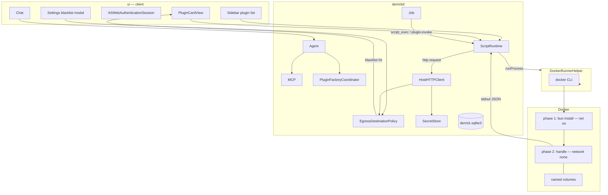

# Software Factory: Sandboxed Complementary Plugins for Derrick

| Field | Value |
| --- | --- |
| **Title** | Software Factory — one Bun runtime, JSON UI/HTTP, host-side blacklist |
| **Author** | TBD |
| **Date** | 2026-08-13 |
| **Status** | Draft (core locks 2026-08-13) |
| **Audience** | Senior engineers working in this repo |
| **Supersedes** | Factory draft 2026-08-12 (split script vs plugin runtimes; in-container CONNECT allowlist) |
| **ADR** | [adr-bun-script-runtime.md](adr-bun-script-runtime.md), [adr-agent-plugins.md](adr-agent-plugins.md) |

---

## Overview

Busy users command complementary features into existence. A factory (orchestrator + sub-agents + fail-closed reviewer) produces a **frozen JavaScript plugin**. One-off scripts use the **same** container, bus, and host HTTP path; they are not persisted.

User JS never opens sockets, never sees secret values, and never speaks XPC. It returns a closed JSON list. `derrickd` performs HTTP, UI cards, jobs, and chat posts. Egress policy is a **host-side blacklist** in front of Swift (not a Docker CONNECT proxy).

Plugins cannot modify Swift, the host filesystem, or intercept in-box services.

---

## Background & Motivation

### Current state

| Layer | Today |
| --- | --- |
| Tool | `script_exec` — TypeScript (`handle: HandleResult` + envelope array) |
| Network | Guest `--network none` after setup; Swift host HTTP + blacklist policy |
| Pool | One shared queue, max 3, 1 warm (`DockerNetworkContainerPool`) |
| Persistence | One-shot scripts are not installed; jobs freeze `script_exec` args |
| Plugin package | `packages/Plugin` contract types (verbs, SSRF, cards) |
| Playwright | Out of this image (separate browser-UI tool later) |

The previous guest language and in-container CONNECT allowlist are recorded in [adr-docker-script-runtime.md](adr-docker-script-runtime.md) (superseded).

### Why the 2026-08-12 “two principals, two runtimes” draft is obsolete

Product lock: **one container style**. Dual pools and “plugins are `--network none` while scripts use EgressProxy” collapse into one Bun lease and one Swift HTTP gate. Trust still differs by **review lifetime**, not by sandbox.

### Pain the factory still solves

One-shot scripts cannot become a reusable feature. Users who do not write software still want Gmail / Slack / news / research. The factory is the product; the plugin is the artifact.

---

## Goals & Non-Goals

### Goals

- One Bun image, one pool, two-phase lease (install → cut net → handoff).
- JSON bus for **UI and HTTP** for both `script_exec` and `plugin.invoke`.
- Plugins: review once, hash, run that hash. Scripts: review every run, then the same hop loop.
- Secrets in Swift (`plugin-secrets.env` iff `IS_DEBUG=true`, else Keychain). Never in the container or the model.
- EgressProxy **policy** kept: default allow; empty soft blacklist (Settings); exact or `*.domain` rows; hard SSRF never overridable. Interactive **modal**; scheduled job **banner**.
- Tiny JSON cards in SwiftUI.
- Short-lived `handle(event) → messages[]`. No plugin daemon.
- Triggers v1: `manual`, `schedule`, `message_in_room`.
- Jobs freeze `script_exec` only (plugin schedules stay in-process `CreateScheduleRequest`).

### Non-goals (v1)

- Official vendor SDKs (`@slack/bolt`, `googleapis`, …).
- Plugin-opened `fetch` / `net` / `Bun.connect` after handoff.
- Plugin XPC, WKWebView login, Apple Container.
- Playwright / Chromium in this image (separate browser-UI tool).
- Inbound webhooks in the plugin (host `WebhookService` next).
- `call_tool`, `wake_agent`, general RPC.
- Plugin application data in `derrick.sqlite3`.
- Factory reading host `.env`.

---

## Proposed Design

### 1. Process and trust topology

Scripts and plugins are **content**. Authenticity is review + (for plugins) `content_hash`. XPC + code signing stay on Agent / Job / MCP / `DockerRunnerHelper`.



**Invariant:** after handoff the container cannot reach the internet or `host.docker.internal`. The CONNECT listener on `:18080` is unused on the run path.

### 2. One runtime, two review lifetimes

| | `script_exec` | `plugin.invoke` |
| --- | --- | --- |
| Language | Bun, TypeScript | Same |
| Lease | Two-phase, destroy after | Same |
| Bus | Same 7 verbs | Same |
| HTTP | Host client + blacklist | Same |
| Review | **Every run** (static + LLM, fail closed) | **Install / permission growth only** |
| Persist | No (job may freeze args) | Named volumes + grant + hash |
| Deps | Declared on that call; install in setup | Declared in manifest; install at promote (or first invoke if lockfile changed) |

`packages/Plugin` remains the **contract** (schemas, blacklist matching, envelopes). It does not execute JS and does not talk XPC.

```
packages/Plugin/Sources/Plugin/
  Manifest/   Agent plugin.json + app.derrick runtime (triggers, auth, quotas)
  Envelope/   PluginVerb, invoke/result DTOs
  UI/         PluginUICard
  HTTP/       HostHTTPRequest/Response, PluginSSRFPolicy (hard blocks)
  Egress/     BlacklistEntry (exact | suffix), BlacklistMatcher
  Identity/   PluginID, content hash
```

Daemon: `ScriptRuntime`, `PluginFactory`, `HostHTTP`, `PluginSecrets` in `derrickd`.  
UI: `PluginCardView`, `PluginPermissionCard`, `PluginListView`, `EgressBlacklistSettingsView`.

### 3. Two-phase lease (single pool)

One `DockerScriptContainerPool` (replaces `DockerNetworkContainerPool` + the drafted plugin-only pool). Max **2** live slots (1 invoke/script, 1 factory/`VolumeIO`). FIFO. Destroy after user code. Same TTL (`ContainerLifecyclePolicy.derrickDefault`, 7 minutes default).

**Illegal CLI:** `docker run`, `docker cp`. Volume I/O is `create` → `start` → `exec -i` (stdin ≤ 5 MiB) → `rm -f`. `volume rm` only `^derrick-(plugin-code|plugin-data|plugin-staging|script-scratch)-[a-z0-9-]+$`. Helpers volume `derrick-script-helpers` is **not** rm-able.

#### Phase 1 — setup

- Mounts: code/staging + data + helpers.
- Network **on** (bridge, **no** CONNECT proxy required).
- Write `package.json` from declared deps (and `bun.lock` if present).
- `bun install` — **author install hooks run** (product lock). Residual: a declared package’s `postinstall` has network before handoff. Reviewer treats the dep list as part of the artifact.
- Do not inject secrets or `auth_ref` values.

#### Phase 2 — handoff

- `--network none`, `--read-only` root, tmpfs `/tmp`, cap-drop ALL, no-new-privileges, **no** `--add-host host.docker.internal`, **no** `HTTP_PROXY`.
- Exec: `bun /opt/derrick/runner.ts` (host-owned).
- `fetch`, `node:net`, `Bun.connect` fail. Verifier also bans them.

#### Volumes

| Name | Mount | Runtime | Purpose |
| --- | --- | --- | --- |
| `derrick-plugin-code-{id}-{hash8}` | `/plugin` | ro | Frozen plugin tree |
| `derrick-plugin-data-{id}` | `/data` | rw | Opt-in only (`volume.enabled`). Plugin SQLite, archives, HTTP blobs |
| `derrick-plugin-staging-{factory}` | `/workspace` | rw factory | Generate |
| `derrick-script-scratch-{invoke}` | `/workspace` | rw | One-shot script + its `node_modules` |
| `derrick-script-helpers` | `/opt/derrick` | ro | `runner.ts`, `derrick.ts` |

Plugin tree (Agent Plugins 1.0 + Derrick extension). See [adr-agent-plugins.md](adr-agent-plugins.md).

```
/plugin/
  plugin.json                 # Agent Plugins 1.0 only (closed schema)
  skills/<name>/SKILL.md      # Agent Skills — when to use this plugin
  app.derrick/
    runtime.json              # triggers, auth_refs, quotas, dependencies
    plugin.js                 # export function handle(event)
    bun.lock                  # required if dependencies nonempty
/data/…                       # only if volume.enabled; not a host path in the guest env
```

**Host helper** (`derrick.ts`) is the guest SDK (types + `netFetch` / `httpBody` / `headlines` / …). No sockets, no env secrets. Source of truth: `ui/SharedAgentRuntime/Resources/guest/derrick.ts`. Guest scripts `import { netFetch, type HandleEvent, type HandleResult } from "derrick"`.

**TS contract:**

```ts
interface PluginParams {}
export function handle(event: HandleEvent<PluginParams>): HandleResult
```
```

- Return must be an array of objects. Anything else → invoke fail.
- Runner redirects stdout/stderr during `handle()`; serializes **only** the return value. `console.log` cannot inject envelopes.
- `event.kind`: `manual` | `schedule` | `message_in_room` | `http_results` | `ui_action` | `grant_ready` | `harness` | `script`.

### 4. Agent Plugin package (plugins)

No per-plugin HTTP **allowlist**. Public HTTPS is default-allow; the host blacklist + hard SSRF apply.

Portable identity is standard [`plugin.json`](https://agent-plugins.org/specification) (`$schema`, `name`, `version`, `description`, …). Derrick-only fields are **not** top-level. They live in `app.derrick/runtime.json` (and `extensions["app.derrick"]` pointers).

```json
{
  "$schema": "https://agent-plugins.org/schemas/1.0.0/plugin.schema.json",
  "name": "daily-news",
  "version": "1.0.0",
  "description": "Headlines from one news host.",
  "extensions": {
    "app.derrick": {
      "entrypoint": "./app.derrick/plugin.js",
      "runtime": "./app.derrick/runtime.json"
    }
  }
}
```

`app.derrick/runtime.json` still declares **deps**, **auth_refs**, triggers, UI, quotas:

```json
{
  "entrypoint": "plugin.js",
  "dependencies": { "example": "^1.0.0" },
  "triggers": [
    { "kind": "manual" },
    { "kind": "schedule", "interval_seconds": 3600 },
    { "kind": "message_in_room", "match": { "prefix": "/news" } }
  ],
  "auth_refs": [],
  "ui": { "schema_version": 1, "surfaces": ["card"] },
  "jobs": { "schedule": true },
  "volume": { "enabled": false, "quota_bytes": 268435456 },
  "quotas": {
    "timeout_seconds": 60,
    "http_calls_per_invoke": 20,
    "http_json_bytes": 1048576,
    "http_file_bytes": 10485760
  }
}
```

| Field | Rule |
| --- | --- |
| `plugin.json` `name` | Agent Plugins: 1–64 chars, `a-z` `0-9` `-` `.`, no `--` / `..` |
| `entrypoint` | Plugin-relative, starts with `./`, no escape, must be `*.js` |
| `dependencies` | npm names the factory declared; installed at promote |
| `triggers[].match.prefix` | Length ≥ 2; `^[A-Za-z/].+`; reject `""` / `"/"` |
| `auth_refs[].provider` | Host registry only (`google`, `telegram`, …) |
| `interval_seconds` | Minimum 60 |
| Factory `mcp.json` | **Omit in v1.** Do not ship stdio MCP from generated code. |
| `volume.enabled` | Default **false**. No `/data` mount. Factory sets `true` only if the plugin must remember state across invokes (archives, cursors, dedupe). Not chat memory; not secrets. |

Permission growth (new `auth_ref`, trigger, higher quota, **new deps**, **`volume.enabled` false→true**) → new version, re-review, re-hash, re-ack.

`script_exec` args:

```json
{
  "description": "…",
  "reason": "…",
  "dependencies": { "example": "^1.0.0" },
  "script": "export function handle(event) { return [/* envelopes */]; }"
}
```

No `allow_network`. Reviewer sees script + dep list every run.

### 5. Envelope JSON

Shared identity fields: `schema_version`, `plugin_id` or `script`, `version?`, `content_hash?`, `invoke_id`, `seq`.

Host → guest: `invoke` / `cancel`. Secrets never values; `auth_refs` are **names**.

Guest → host (closed):

| Verb | Host action |
| --- | --- |
| `message.post` | Chat / `notify_session_id` / `JobResultDTO` (same routing as before) |
| `result.emit` | Tool / job result |
| `ui.present` | SwiftUI card; wait `ui.action` |
| `secret.request` | Grant card; no value |
| `job.schedule` | JobService if manifest allows |
| `http.request` | `HostHTTPClient` |
| `log` | `service_logs` only |

Rejected: `call_tool`, `wake_agent`, `rpc`, `xpc`, `fetch`, anything else.

`message.post` destination unchanged: agent chat; schedule → `notify_session_id` + notification; missing destination → fail the verb.

### 6. Invoke / hop loop

Same dispatcher as the 2026-08-12 draft:

| Class | Verbs |
| --- | --- |
| Continuation | `http.request`, `ui.present`, `secret.request` |
| Terminal | `result.emit`, `message.post` |
| Side | `log`, `job.schedule` |

HTTP-before-wait; one wait verb; max **8** hops; 5 min UI/grant wait on `pending_plugin_waits`. Harness: fixture HTTP only (`event.kind == harness`), no live client.

Each hop is a **phase-2** exec. Do not re-run `bun install` on hops of the same invoke (reuse the scratch/code volume from setup).

### 7. Host HTTP + EgressProxy as blacklist

`HostHTTPClient` in derrickd. **Not** in-container CONNECT.

Keep `packages/EgressProxy` for:

- Hard SSRF lists (`blockedHostnames`, IPv4/IPv6 CIDRs) — **never overridable**, no modal
- `HostAccessPrompter` / `PolicyUserEvent` once / always / deny
- `SystemDNSResolver` pattern (copy or share; client is still `NWConnection` + HTTP/1.1, not `URLSession`)

Delete (run path): container `HTTP_PROXY` env, iptables-to-proxy, “unknown host → prompt to **allowlist**.”

#### Policy order

1. Parse URL. Strip plugin `Authorization` / `Cookie` / `Proxy-Authorization`.
2. **Hard deny:** `localhost`, `*.local`, docker internals, `metadata`, literal IPs, `file:`/`unix:`, private/link-local/metadata CIDRs including mapped-IPv6 and `64:ff9b::/96`. No prompt.
3. Resolve; if **any** address is hard-blocked → deny (pin connect to checked addresses; never follow redirects).
4. Soft **blacklist** match (`BlacklistMatcher`). No match → allow.
5. Match → prompt (below). Then attach `auth_ref` if any.

#### Soft blacklist

- Empty at first launch.
- Edited in **Settings → Network blacklist** (config modal).
- Two shapes only:

| Entry | Matches |
| --- | --- |
| `api.example.com` | Exact host only |
| `*.example.com` | Subdomains only — **not** apex `example.com`. Add both to cover the site. |

- Lowercase; no ports in the entry.
- Longest match wins (exact beats suffix).
- Reject `*`, `*.com`, and public-suffix wildcards.
- **This run** = this `invoke_id` only. **Always** = permanent **exception** for the **entry that matched** (do not invent a new suffix). **Deny** = fail that `http.request` hop.

#### Prompt UX

| Caller | UI |
| --- | --- |
| Interactive chat / factory | **Modal** (`PolicyUserEvent` userDecision) |
| Scheduled job / UI absent | **Banner** + HITL wait; timeout **fail closed** |

Copy: “This script/plugin wants `https://…` which matches blacklist `*.bank.com`.”

#### `auth_ref` attach (unchanged idea)

`PluginAuthProvider` splits `attachHosts` vs `tokenHosts`. Attach secret **only** if `url.host ∈ attachHosts` and the ref is granted. Never attach to token endpoints. Telegram path-rewrites on the host. Plugin URL must not already contain a token.

Default-allow does **not** mean “send the Gmail token anywhere.” Exfil of **data** to a non-blacklisted host is still possible after the plugin received a stripped Gmail body — user-visible if they `message.post`; otherwise only `/data`. Accepted for v1 given isolation + no secrets in the guest.

Transport: `NWConnection` + minimal HTTP/1.1-over-TLS (one request per connection, `Host`+SNI = hostname, no gzip/HTTP2/cookies/redirects). Tests use a fake `HTTPTransport`.

### 8. Secrets / OAuth

Same as the reviewed 2026-08-12 flow (daemon-owned PKCE, `ASWebAuthenticationSession`, `pluginGrantAck.secretMaterial` not logged, Telegram `SecureField`). Debug: group `plugin-secrets.env`, never host `.env`.

### 9. UI cards

Unchanged widget set: `text`, `markdown`, `table`, `select`, `text_field`, `link`, `button`. SwiftUI only. Click → re-invoke `{ action_id, fields }`.

### 10. Factory loop

Unchanged stages: spec → generate `/workspace` → static JS verify → LLM review vs spec → harness (fixtures) → human card → Swift promote + hash.

- `FactorySessionID` prefix `factory-`; recents exclude `factory-%` and `job-%`.
- Upsert `chat_sessions` (job pattern). Progress: `factory_stage` notices only.
- Factory tools: `factory.spec_write`, `workspace_*`, `static_verify`, `review`, `harness_run`, `propose_install`. No `plugin.install`.
- `PluginScriptReviewer` is a **new** JS/spec reviewer (do not wrap `ReviewerSystemPrompt`).
- Usage buckets: `maxFactoryReviewerCallsPerBuild` / `maxHarnessRunsPerBuild` (defaults 6), `decodeIfPresent`, per `factory_sessions.session_id`.
- First sample: **Daily news** (no auth), one news host via host HTTP.
- Hash: SHA-256 of canonical source + `plugin.json` + `app.derrick/**` + `skills/**` + `bun.lock` (not `node_modules`). Promote installs deps in setup, then stores the lockfile. Invoke rehash mismatch → disable.

### 11. `script_exec` (hard replace)

`script_exec` is the user-facing tool. Static JS verify + script reviewer every run. No `allow_network`. No egress allowlist preflight in `ConversationPipelineToolInterception`.

New tool `script_exec` (MCPService):

1. Static JS verify (ban `fetch`, `node:http`, `Bun.connect`, `child_process`). Destination URLs are not scanned here — host SSRF denies them at fetch time.
2. LLM reviewer vs goal/description + script (secrets, missing-params). Types, `fetch`/sockets, destinations, and `plugin_id` are host/`tsc` — not reviewer.
3. Two-phase lease; hop loop.
4. Blacklist prompts as in §7.

`JobOrderBuilder.allowedToolNames` = `{ script_exec }`. Chat still cannot freeze `plugin.invoke`.

`UsageLimits`: `maxScriptRunsPerMessage` + script-reviewer cap.

### 12. Static verifier (JS)

In-process scanners (no Bun required for the cheap pass). Ban:

- `fetch(`, `node:net`, `node:http`, `node:https`, `undici`, `Bun.connect`, `Bun.serve`, `child_process`, `node:child_process`
- Guest TypeScript 7 `tsc --noEmit` (Go compiler; types from `derrick.ts`) — fail with compiler output

Do not scan source for destination hostnames or private IPs. The guest has no network. Host HTTP applies `PluginSSRFPolicy` on each `netFetch` URL.

Best-effort only. `--network none` is the real net fence.

### 13. What agents see

| Session | Visible | Hidden |
| --- | --- | --- |
| Factory | spec, source, review, harness | `.env`, tokens, raw HTTP |
| Normal chat | `plugin.invoke` / `script_exec` result, `message.post` | Source (plugins), raw HTTP unless posted |

### 14. Triggers v1

Unchanged: manual; schedule via in-process `CreateScheduleRequest`; `message_in_room` prefix, skip LLM iff exactly one match. Webhooks not v1.

### 15. Identity

`ServicePrincipal.plugin(pluginID:version)` + `JobSource.plugin`. HMAC `plugin:{id}:{version}`. Update every exhaustive switch in the same PR as the case.

---

## API / Interface Changes

| Name | Where | Notes |
| --- | --- | --- |
| `script_exec` | MCPService | One-off guest JS |
| `plugin.invoke` | MCPService, flag-gated | |
| `factory.build` | Agent local, flag-gated | |
| `factory.*` | Factory session only | |

Daemon XPC (existing Mach service): `pluginGrantAck`, `pluginList`, `pluginSetEnabled`, plus Settings reads/writes for blacklist rows. `secretMaterial` never logged.

Info.plist: `derrick://oauth/google` (host change).

---

## Data Model Changes

`DatabaseSchema.latestVersion = 18`. `case 18: return "plugins"` **and** blacklist tables (or `0018_plugins` + `0019_egress_blacklist` if split).

Plugin tables: same as 2026-08-12 (`plugins`, `plugin_versions`, `plugin_grants`, `plugin_invokes`, `pending_plugin_waits`, `factory_sessions`) **minus** grant `hosts_json` as an allowlist. Grants store `auth_refs_json`, `attach_hosts_json`, `notify_session_id`, deps snapshot.

```sql
CREATE TABLE egress_blacklist (
    id TEXT PRIMARY KEY NOT NULL,
    pattern TEXT NOT NULL,          -- 'api.example.com' or '*.example.com'
    kind TEXT NOT NULL,             -- exact | suffix
    created_at TEXT NOT NULL,
    UNIQUE (kind, pattern)
);

CREATE TABLE egress_blacklist_exceptions (
    id TEXT PRIMARY KEY NOT NULL,
    pattern TEXT NOT NULL,
    kind TEXT NOT NULL,
    created_at TEXT NOT NULL,
    UNIQUE (kind, pattern)
);
```

“Always allow” on a blacklist hit inserts an **exception** (or deletes the row — pick exception so Settings still shows the user’s original list). Session “this run” is in-memory on the invoke, not SQL.

Enabled source of truth: `plugins.enabled`. Version `status` is lifecycle only.

Install / update / disable / delete: Swift-only promote; delete keeps `plugin_invokes` (SET NULL).

---

## Alternatives Considered

| Alt | Decision |
| --- | --- |
| Two guest languages / two container styles | Rejected. One Bun style. |
| In-container CONNECT allowlist | Rejected for run path. Policy moved in front of Swift; blacklist. |
| `--network none` with no setup net | Rejected. Deps declared up front; install hooks allowed during setup. |
| Official SDKs / Node | Rejected. Host HTTP + guest TypeScript on Bun. |
| Plugin speaks XPC | Rejected. |
| WKWebView login | Deferred. |
| Host bind-mount plugin dir | Rejected. Named volumes. |
| Playwright in the Bun image | Rejected. Separate browser-UI tool. |
| Custom root `manifest.json` | Rejected. Agent Plugins 1.0 `plugin.json`; Derrick fields under `app.derrick`. |
| Download-only `bun install --ignore-scripts` | Rejected. Product wants hooks during setup. |
| Delete EgressProxy package | Rejected. Keep policy + modal/banner; invert to blacklist. |

---

## Security & Privacy

| Threat | Mitigation |
| --- | --- |
| Guest `fetch` after handoff | `--network none` + verifier |
| Setup `postinstall` with net | Accepted; dep list reviewed (every script run / plugin install) |
| SSRF to host / metadata | Hard deny, no modal, DNS pin |
| Token exfil via HTTP | Secrets never in guest; attach only on `attachHosts` |
| Data exfil to random HTTPS | Default allow + empty blacklist. User can add `*.evil.com`. Isolation limits blast radius; residual accepted |
| Reviewer-once volume swap | Hash; Swift promote; disable on mismatch |
| Stdout envelope inject | Runner serializes only `handle()` return |
| Blacklist “Always” re-opens a host | Exception is explicit and visible in Settings |
| Factory reads `.env` | No env mount; separate `plugin-secrets.env` |

---

## Observability

Log destination is exclusive:

- **Debug** (`IS_DEBUG=true`): all operator logs (including factory/tool traces) go to the **debug panel only**. Do not write `service_logs`.
- **Non-debug**: all operator logs go to **`service_logs` only** (`script_exec_*`, `plugin_invoke_*`, `plugin_http`, `egress_blacklist_hit`, `plugin_hash_mismatch`, `factory_stage`). Do not write the debug panel.

Never log `Authorization` or `secretMaterial`.

---

## Rollout

1. Settings flag “Software Factory” off in Release; one script tool (`script_exec`).
2. S1: hello `script_exec` / `plugin.invoke` without HTTP.
3. S2: host HTTP + empty blacklist + Settings editor.
4. S3: cards + secrets.
5. S4: factory + daily-news sample.
6. S5: schedule + `/prefix` + sidebar.
7. Rollback: flag off; leftover volumes ok; no DB downgrade.
8. Keep `Agents.md` aligned with the Bun Docker-only runtime.

Playwright browser-UI tool: **separate design**, not this rollout.

---

## Risks

| Risk | Severity | Mitigation |
| --- | --- | --- |
| Setup hooks with network | High | Review deps; short setup; no secrets in that phase |
| Default-allow data exfil | Medium | Empty blacklist + Settings; no tokens in guest |
| Frozen jobs that still name a retired tool | High | Recreate the job as `script_exec` |
| One pool starves factory vs invoke | Medium | Max 2 slots (invoke vs helper) |
| JS verifier is best-effort | Medium | `--network none` is the fence |
| HTTP/1.1 client cost | Medium | Fake transport tests; one request per connection |

---

## Open Questions

None. Product owner locked: daily news sample; sidebar plugin list; Bun + TypeScript 7 (Go `tsc` in guest, types from host JSON Schema); setup install hooks; host-side blacklist (empty, `exact` or `*.domain`); Playwright out of this image.

---

## References

- [adr-bun-script-runtime.md](adr-bun-script-runtime.md)
- [adr-agent-plugins.md](adr-agent-plugins.md)
- [adr-docker-script-runtime.md](adr-docker-script-runtime.md) (superseded)
- [adr-headless-backend.md](adr-headless-backend.md), [services-plan.md](services-plan.md)
- `packages/EgressProxy` — policy kept; CONNECT run-path retired
- `packages/DockerRunnerXPC`, `packages/Plugin`, `JobOrderBuilder`, `UsageLimits`

---

## Key Decisions

1. **One Bun runtime** for scripts and plugins. TypeScript 7 (Go `tsc`) + one image.
2. **Two-phase lease:** `bun install` (hooks on) → cut net → handoff.
3. **JSON bus for UI and HTTP.** Guest has no run-path network.
4. **Review:** scripts every run; plugins once + hash.
5. **EgressProxy sits in front of Swift.** Blacklist, not allowlist. CONNECT `:18080` unused at run.
6. **Soft blacklist** empty at launch; Settings modal; `host` or `*.domain` (subdomains only, not apex). Hard SSRF never prompted.
7. **Blacklist UX:** modal if interactive; banner if scheduled. This run / always (exception) / deny.
8. **Secrets stay in Swift.** `auth_ref` + `attachHosts` / `tokenHosts`.
9. **`packages/Plugin` is the contract.** Named volumes; `create`/`start`/`exec`/`rm` only.
10. **One pool, max 2 slots** (invoke vs factory/VolumeIO), 1 warm invoke. 7m work TTL.
11. **Hop loop max 8.** Same dispatcher. Harness fixtures only.
12. **Separate JS reviewer** + factory usage buckets.
13. **Daemon-owned OAuth** (PKCE, `derrick://oauth/google`).
14. **Swift promotes.** Factory cannot install.
15. **Schedules:** in-process `CreateScheduleRequest`. `JobOrderBuilder` = `{ script_exec }`.
16. **JSON cards**, no WebView.
17. **Webhooks later** on the host.
18. **`/prefix` skip-LLM** iff exactly one match.
19. **`factory.build` always-on** when the flag is on.
20. **One enabled version** per `plugin_id`.
21. **`NWConnection` + HTTP/1.1.** No redirects.
22. **`notify_session_id`** for scheduled posts.
23. **Factory sessions** are `factory-%` (hidden recents).
24. **First sample:** daily news (no auth).
25. **Plugin list:** sidebar.
26. **Playwright:** separate browser-UI tool, not this container.
27. **Deps declared up front** by the LLM; not `bun add` from user JS after handoff.
28. **`/data` is opt-in.** `volume.enabled` default false. Factory must request it; user acks. Not session memory.

---

## PR Plan

**Demoable after PR 5** (hello `script_exec` hop loop, no HTTP). **Factory after PR 12.** One script tool in Release.

### PR 1 — Contract package

- **Title:** Plugin/script schemas, verbs, blacklist matcher, hard SSRF types
- **Files:** `packages/Plugin/**`
- **Depends on:** nothing
- **Description:** Agent Plugins `plugin.json` + `app.derrick` runtime (JS entry, `dependencies`), `BlacklistMatcher` (exact / suffix), `PluginSSRFPolicy` hard blocks, envelopes, UI widgets, `PluginAuthProvider`. No app wiring.

### PR 2 — DB + principal + flags

- **Title:** `0018` plugins + blacklist/exceptions; `ServicePrincipal.plugin`; factory flag
- **Files:** migrations, `DBRepositoryPlugins`, `ServicePrincipal`, `JobSource.plugin`, `UsageLimits` (`decodeIfPresent`), recents `factory-%`
- **Depends on:** PR 1
- **Description:** No `AllowedMCPTool` cases yet.

### PR 3 — Settings blacklist editor

- **Title:** Empty blacklist modal (exact and `*.domain`)
- **Files:** Settings UI, daemon list/add/remove, `BlacklistMatcher` tests
- **Depends on:** PR 2
- **Description:** No HTTP client yet. Persist rows. Reject public-suffix wildcards.

### PR 4 — Bun image + two-phase pool + VolumeIO

- **Title:** `derrick-bun` image, one pool, helper inject `runner.ts` / `derrick.ts`
- **Files:** `DockerScriptPreparer` Bun image, `DockerNetworkContainerPool`, `DockerHostLaunch` `volume rm` prefix, VolumeIO
- **Depends on:** PR 1
- **Description:** Setup install + `--network none` handoff. Tests reject `run`/`cp`.

### PR 5 — `script_exec` hop loop — **S1 demo**

- **Title:** `script_exec` hop loop
- **Files:** MCP tool module, reviewer (JS), pipeline interception, `JobOrderBuilder`, jobs freeze
- **Depends on:** PR 2, PR 4
- **Description:** Hello script `message.post`. Review every run.

### PR 6 — `plugin.invoke` loop

- **Title:** Same runner, grant + hash, no HTTP
- **Files:** PluginRuntime, flag-gated `AllowedMCPTool.pluginInvoke`
- **Depends on:** PR 5
- **Description:** Test-only volume + grant. Hello plugin posts text.

### PR 7 — Host HTTP + blacklist prompts

- **Title:** `HostHTTPClient` + policy in front of Swift
- **Files:** HTTP/1.1 + `NWConnection`, wire `DefaultDestinationPolicy` inverted (or new `BlacklistDestinationPolicy`), modal + job banner
- **Depends on:** PR 3, PR 5
- **Description:** Default allow; hard SSRF; soft list; this run / always / deny. Stop setting `HTTP_PROXY` on run containers.

### PR 8 — Secrets / OAuth

- **Title:** Secret store, ASWebAuthenticationSession, Telegram rewrite
- **Depends on:** PR 7
- **Description:** Same as previous PR 6. `tokenHosts` never attached.

### PR 9 — SwiftUI cards

- **Depends on:** PR 5
- **Description:** v1 widgets; `ui.action` resume.

### PR 10 — JS static verifier

- **Depends on:** PR 1
- **Description:** Shared by `script_exec` and factory. Ban sockets/TS/secrets.

### PR 11 — Factory workspace

- **Depends on:** PR 4, PR 2
- **Description:** `factory.build` behind flag; `factory-%` sessions; VolumeIO writes.

### PR 12 — Factory review / harness / promote — **factory demo**

- **Depends on:** PR 8, PR 10, PR 11, PR 6
- **Description:** `PluginScriptReviewer`; fixture harness; `pluginGrantAck` only install path; daily-news can be generated here.

### PR 13 — Schedule + `/prefix`

- **Depends on:** PR 12
- **Description:** In-process schedules; skip LLM on unique prefix.

### PR 14 — Sidebar plugin list

- **Depends on:** PR 12
- **Description:** Enable / disable / open. Kill switch stays Settings.

### PR 15 (follow-on) — Host webhooks

- **Depends on:** PR 13 + WebhookService P5

### PR 16 (separate design) — Playwright browser-UI tool

- Not this runtime. No Chromium in `derrick-bun`.
