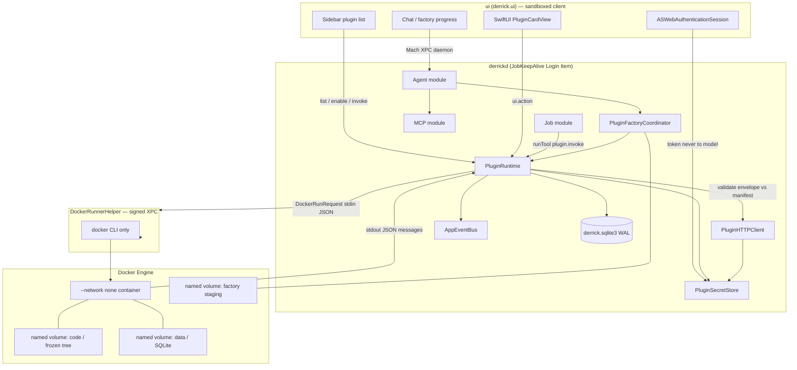
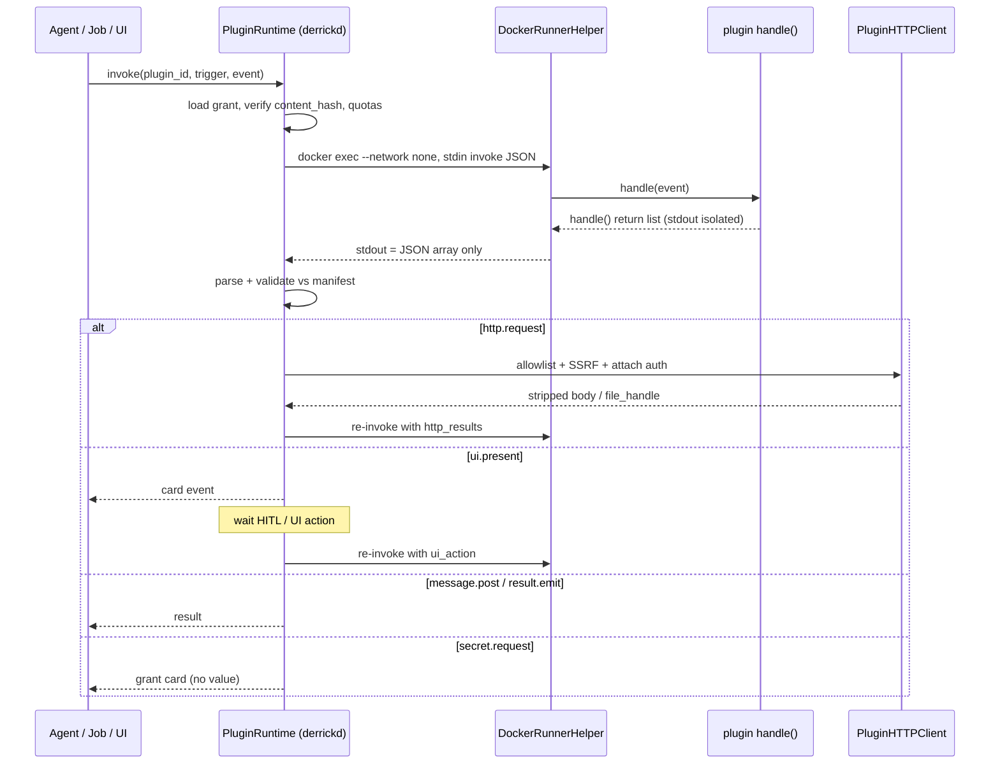
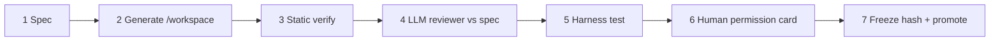

# Software Factory: Sandboxed Complementary Plugins for Derrick

| Field | Value |
| --- | --- |
| **Title** | Software Factory — sandboxed complementary plugins |
| **Author** | TBD |
| **Date** | 2026-08-12 |
| **Status** | Draft (revised after review 2026-08-12) |
| **Audience** | Senior engineers working in this repo |
| **Supersedes** | `packages/Plugin` stub (`hello()`) |
| **Does not change** | `python_script_exec`, EgressProxy, Apple Container (forbidden) |

---

## Overview

Busy users should be able to **command a complementary plugin into existence** from one prompt. A factory (orchestrator + sub-agents + the existing fail-closed reviewer) produces a **structured, persisted Python plugin** that is almost the same shape as today's `python_script_exec` — short-lived Python in Docker — but frozen, permissioned, and invoked later.

Plugins are **not** "build anything." They cannot modify Swift, the host filesystem, or intercept in-box features. They are sandboxed subfeatures the product does not ship: Gmail, Slack, Telegram, current events, research topics, and similar. The plugin never opens sockets, never sees secret values, and never speaks XPC. It emits a closed JSON bus; `derrickd` validates each envelope against a human-acked manifest and performs HTTP, UI, jobs, and chat posts on the plugin's behalf.

This document specifies package layout, envelopes, host HTTP/SSRF, secrets/OAuth, UI cards, factory tools, storage, Docker mapping, verifier extensions, lifecycle, quotas, identity, risks, PRs, and locked decisions.

---

## Background & Motivation

### Current state

Derrick already runs untrusted Python through a hardened path:

| Layer | Reality in tree |
| --- | --- |
| Tool | `python_script_exec` — `packages/MCPServer/Sources/MCPServer/PythonScript/PythonScriptExecutionToolModule.swift` |
| Static gate | `PythonScriptExecutionVerifier.validate` — same package, fail-fast regex + package/mode checks |
| LLM reviewer | `MCPServicePythonReviewer` → `OpenAIPythonScriptReviewer` / `GeminiPythonScriptReviewer`; fail-closed on missing assessment, `alignedWithRequest == false`, or `suggestedAction` `deny`/`confirm` (`runPythonScriptToolBody`) |
| Runtime | Docker only — `docs/adr-docker-script-runtime.md`. `DockerRunnerHelper` XPC + `DockerNetworkContainerPool` (network max 2 + 1 warm; offline max 1; exclusive slot; recreate after run; default 7-minute lease via `ContainerLifecyclePolicy.derrickDefault`) |
| Network | Container `--network bridge` + iptables OUTPUT DROP except host proxy; `EgressProxy` + `DefaultDestinationPolicy`; preflight in `ConversationPipelineToolInterception` |
| Persistence of scripts | **None.** Jobs freeze `python_script_exec` args (`JobOrchestrationToolModule`, v1 effector only) and re-run the same blob. There is no install, no per-script volume, no secret grant. |
| Daemon | UI is a client. Agent + Job + MCP live in `derrickd` (`docs/adr-headless-backend.md`, `docs/services-plan.md`). WebhookService is **P5 pending**. |
| Plugin package | `packages/Plugin` is a stub (`public func hello()`). Tests are a placeholder. |

### Pain points

1. One-shot scripts cannot become a reusable Gmail/Slack/Telegram feature without the user (or agent) pasting the same script again.
2. Official vendor SDKs need sockets and tokens. That is incompatible with host-mediated HTTP and "plugin never sees secrets."
3. EgressProxy is a **user-prompted domain suffix** system designed for crawls (`github.com`, `pypi.org`, mid-flight Allow once/Always). A plugin that can grow `*.googleapis.com` via the same prompt is a confused deputy.
4. Users who do not write software still want complementary integrations. The factory is the product surface; the plugin is the artifact.

### Why not extend `python_script_exec`?

Locked: coexistence. One-shot stays including EgressProxy. Factory plugins are a different principal: `--network none`, host HTTP, persisted tree + manifest, human-acked grants. Merging would force every crawl script through plugin install UX, or every plugin through mid-flight suffix grants.

---

## Goals & Non-Goals

### Goals

- One user prompt → staged factory → human permission card → frozen plugin.
- Complementary only: the **plugin** cannot edit Swift, host FS, Info.plist, or in-box services. The **host** may add OAuth URL types and Settings (see §9).
- Python only, existing image (`DockerScriptPreparer.defaultImage` = `derrick-python:baseline-6`), plugin-specific static verifier + a **separate** `PluginScriptReviewer` (not a wrap of `ReviewerSystemPrompt`).
- Host-mediated allowlisted HTTP; secrets in Swift (`plugin-secrets.env` iff `IS_DEBUG=true`, else Keychain — same *split* as `MessagesSecretKey`, never the host `.env`).
- Tiny JSON UI cards rendered by SwiftUI (`ui.schema_version`).
- Short-lived `handle(event) → messages[]`. Same Docker lease/TTL class as today's pool. No plugin daemon.
- Triggers v1: `manual`, `schedule`, `message_in_room`.
- Disable/delete drops that plugin's volume + Keychain items.

### Non-goals (v1)

- Plugin-authored changes to the Swift app, Info.plist, entitlements, or in-box services (host-owned OAuth URL scheme is allowed and required).
- Plugin-opened sockets, official vendor SDKs (`google-api-python-client`, `@slack/bolt`, `slack_sdk`, Telegram long poll / Socket Mode).
- Plugin XPC, Mach service names, WKWebView / embedded login, username/password sites without APIs.
- Apple Container / `container` CLI.
- Merging with `python_script_exec` / EgressProxy.
- Long-lived plugin processes; inbound webhooks terminating in the plugin (host `WebhookService` is next).
- `call_tool`, `wake_agent`, or general RPC on the plugin bus.
- Plugin application data in `derrick.sqlite3`.
- Factory or plugin containers reading host `.env`.

---

## Proposed Design

### 1. Process and trust topology

Plugins are **content**, not processes in the Mach mesh. Authenticity is `content_hash` + installed grant, not code signing.



**Invariant:** plugin Python cannot name a Mach service, cannot import a Swift module, and cannot reach `host.docker.internal`. XPC + code signing remain on Agent / Job / MCP / `DockerRunnerHelper` only (`XPCPeerAuthentication` in `packages/DockerRunnerXPC`).

### 2. Keep `packages/Plugin` as the contract module

Do **not** rename. The stub exists for this surface. It becomes a Swift package of **schemas and validation** consumed by `derrickd` and tests. It does **not** execute Python and does **not** talk XPC.

**Rationale:** `MCPServer` owns one-shot `python_script_exec`. Mixing plugin types there would collapse the two principals. `ServiceContracts` is the XPC/DTO mesh; plugin envelopes are not XPC. `Plugin` is the complementary-feature contract.

Proposed layout:

```
packages/Plugin/Sources/Plugin/
  Plugin.swift                      # module umbrella / version constants
  Manifest/
    PluginManifest.swift            # Codable manifest v1
    PluginManifestValidator.swift
    PluginTrigger.swift
    PluginAuthRef.swift
    PluginAuthProvider.swift          # attachHosts vs tokenHosts
    PluginHostGrant.swift
    PluginSpec.swift                  # factory spec.schema_version
  Envelope/
    PluginEnvelope.swift            # inbound + outbound
    PluginVerb.swift                # closed vocabulary
    PluginInvokeRequest.swift
    PluginInvokeResult.swift
  UI/
    PluginUICard.swift              # schema_version + widgets
    PluginUIAction.swift
  HTTP/
    PluginHTTPRequest.swift         # host-bound request DTO
    PluginHTTPResponse.swift        # stripped response DTO
    PluginSSRFPolicy.swift          # pure rules (unit-tested)
  Identity/
    PluginID.swift
    PluginContentHash.swift
  Quotas/
    PluginQuota.swift
```

Daemon-side **orchestration and effectors** (not in the contract package):

```
ui/JobKeepAlive/ + SharedAgentRuntime / new sources compiled into derrickd:
  PluginRuntime/                    # invoke loop, envelope dispatch
  PluginFactory/                    # staged factory coordinator
  PluginHTTP/                       # NWConnection client + SSRF
  PluginSecrets/                    # Keychain / debug .env
  PluginStore/                      # DBRepository extension
```

UI-side:

```
ui/ui/Views/Plugin/
  PluginCardView.swift
  PluginPermissionCard.swift
  PluginListView.swift              # Sidebar section (always visible; enable/disable/open)
```

### 3. Plugin on-disk layout (inside Docker named volumes)

`DockerRunRequestValidator.validateVolumeSpec` **rejects host bind mounts** (`/host:/container`, `./`, `~`). Plugin trees therefore live in **named volumes** (already allowed: `derrick-pip-cache`, `derrick-python-packages`).

**Illegal CLI (do not specify anywhere):** `docker run`, `docker cp`. Today's `DockerHostLaunch.allowedDockerSubcommands` is `version|build|pull|create|start|exec|rm|inspect|volume|image` — no `run`, no `cp`. `allowedVolumeSubcommands` is `create|inspect` today; we add **`rm` only** for names matching `^derrick-plugin-(code|data|staging)-[a-z0-9-]+$`. **`derrick-plugin-helpers` is not rm-able.**

#### Volume bootstrap (single host-owned path)

All volume I/O uses the same helper sequence — never `run`/`cp`, never a host path:

1. `docker volume create <name>` (if missing; `inspect` first).
2. `docker create` with **that invoke's** named-volume mounts + `--network none` + `defaultImage` + offline hold entrypoint (same shape as python offline, **without** `/packages` or pip-cache).
3. `docker start`.
4. `docker exec -i … python -I -u -` with stdin under `DockerHostLaunch.maxStdinBytes` (5 MiB).
5. `docker rm -f` the container (always).

This is `PluginVolumeIO`. Used for:

| Operation | Exec stdin does |
| --- | --- |
| (1) First-boot helpers | Write `/opt/derrick-plugin/runner.py` and `derrick.py` into volume `derrick-plugin-helpers` (host-owned bytes, not factory). **Once-only**, under a daemon `NSLock` / actor so two invokes cannot race an empty helpers volume. Re-inject only if `inspect` shows missing files. **Never `volume rm` this volume.** |
| (2) `factory.workspace_write` | One file per exec, or one tar stream (`tar -x -C /workspace`) decoded in-container. Paths relative, no `..`. Files > ~4 MiB are split across execs or tarred. |
| (3) Promote | New empty code volume; copier exec mounts staging **ro** and code **rw**; copies tree; computes canonical hash to stdout. Runtime later remounts code `:ro`. |
| (4) HTTP overflow | Host → exec writes `/data/blobs/{request_id}` on the plugin data volume. |
| (5) Hash / `du` | Hasher or `du -sb /data /plugin` in-container; parse stdout. No host `du` of Docker's volume dir. |
| (6) Delete | `docker volume rm` only if name matches `^derrick-plugin-(code|data|staging)-`. Reject `derrick-plugin-helpers`, `run`/`cp`, and any other name. |

`DockerPluginContainerPool` must **create per lease** with the mounts for that operation. It cannot call `DockerScriptPreparer.dockerCreateOfflineContainerArguments` (those mount `/packages` + pip-cache and have no plugin volumes).

| Volume name | Mount | Mode at runtime | Purpose |
| --- | --- | --- | --- |
| `derrick-plugin-code-{plugin_id}-{hash8}` | `/plugin` | read-only | Frozen tree (only this hash runs) |
| `derrick-plugin-data-{plugin_id}` | `/data` | read-write | App state, SQLite, large HTTP payloads |
| `derrick-plugin-staging-{factory_session_id}` | `/workspace` | read-write (factory only) | Generation workspace |
| `derrick-plugin-helpers` | `/opt/derrick-plugin` | read-only | Host-owned `derrick` thin helpers — **not** factory-writable |

Runtime tree under `/plugin`:

```
/plugin/
  manifest.json                 # required
  plugin.py                     # required; defines handle(event)
  lib/                          # optional Python modules
  fixtures/                     # optional harness HTTP fixtures
  README.md                     # optional; shown on permission card
/data/
  state.sqlite                  # plugin-owned
  blobs/                        # large HTTP bodies (file handles)
```

Factory agents write **only** `/workspace`. Swift promotion copies `/workspace` → new code volume after review + ack. The factory cannot `cp` to an installed volume (locked).

**Host helper module** (`/opt/derrick-plugin/derrick.py`): builds envelopes only. It must not open sockets or read env secrets. `net_fetch` **only returns a dict**; it has no side effects. `handle` must include that dict in its **return list** or the host never sees it.

```python
# Host-owned. Static verifier treats `import derrick` as allowed.
def net_fetch(*, method: str, url: str, auth_ref: str | None = None, json=None, headers=None) -> dict:
    return {
        "verb": "http.request",
        "request_id": ...,
        "method": method,
        "url": url,
        "auth_ref": auth_ref,
        "json": json,
        "headers": headers or {},
    }
```

**Python contract (required):**

```python
def handle(event: dict) -> list[dict]:
    """Return a list of host-bound envelopes (verb + payload). Never print envelopes."""
```

- Return type must be a `list` of `dict`. Any other type → invoke fail (`result.emit` error synthesized by runner).
- Exceptions → runner stderr + exit 1 → invoke failed.
- Multi-hop: inspect `event["kind"]` (`manual` | `schedule` | `message_in_room` | `http_results` | `ui_action` | `grant_ready` | `harness`). On `http_results`, continue the state machine; do not assume in-process HTTP.

Do **not** bump `DockerScriptPreparer.baselineImageVersion` solely for this file. Inject via `PluginVolumeIO` first-boot into `derrick-plugin-helpers`. Official SDKs stay out of the image.

### 4. `manifest.json` schema (v1)

`manifest.schema_version` is an integer. Unknown newer versions fail closed at install and at invoke.

```json
{
  "schema_version": 1,
  "plugin_id": "gmail-unread",
  "display_name": "Gmail unread digest",
  "version": "1.0.0",
  "description": "Summarize unread mail in the last 24h.",
  "entrypoint": "plugin.py",
  "triggers": [
    { "kind": "manual" },
    { "kind": "schedule", "interval_seconds": 3600 },
    { "kind": "message_in_room", "match": { "prefix": "/gmail" } }
  ],
  "auth_refs": [
    {
      "id": "gmail.readonly",
      "type": "oauth",
      "provider": "google",
      "scopes": ["https://www.googleapis.com/auth/gmail.readonly"]
    }
  ],
  "http": {
    "hosts": [
      {
        "host": "gmail.googleapis.com",
        "ports": [443],
        "schemes": ["https"],
        "methods": ["GET", "POST"]
      }
    ]
  },
  "ui": { "schema_version": 1, "surfaces": ["card"] },
  "jobs": { "schedule": true },
  "volume": { "quota_bytes": 268435456 },
  "quotas": {
    "timeout_seconds": 60,
    "http_calls_per_invoke": 20,
    "http_json_bytes": 1048576,
    "http_file_bytes": 10485760
  },
  "success_checks": [
    "handle returns result.emit or message.post on happy path",
    "no network imports"
  ]
}
```

#### Field rules

| Field | Rule |
| --- | --- |
| `plugin_id` | `^[a-z][a-z0-9-]{1,47}$`, unique among installed + staging |
| `version` | Semver `MAJOR.MINOR.PATCH` |
| `entrypoint` | Relative path, no `..`, must exist, must be `*.py` |
| `triggers[].kind` | v1 enum: `manual` \| `schedule` \| `message_in_room` |
| `triggers[].match.prefix` | Required for `message_in_room`. Length ≥ 2; must start with `/` or a letter (`^[A-Za-z/].+`). Reject `""`, `"/"`, and whitespace-only. Static + factory validate. After normalize, if many plugins match → do not invoke (already specified). |
| `auth_refs[].id` | Stable slug; plugin code refers to this, never a token |
| `auth_refs[].type` | `oauth` \| `token` (Telegram bot token, etc.) |
| `auth_refs[].provider` | Must be a key in host `PluginAuthProvider` registry (`google`, `telegram`, …). Unknown provider → install fail. |
| `http.hosts` | **Exact** registrable hostnames. No `*.googleapis.com`. No IPs. No `localhost`. Human-acked at install. |
| `jobs.schedule` | If false, `job.schedule` verb is rejected even if the plugin emits it |
| `triggers[].interval_seconds` | Required for `schedule`; **minimum 60** (same clamp as `JobRecurrence.every`) |
| `volume.quota_bytes` | Default 256 MiB, max 1 GiB |
| `success_checks` | Free-text; factory reviewer treats these as the spec's acceptance list |

Permission **growth** (new host, new `auth_ref`, new trigger, higher quota) requires a new `version`, re-review, re-hash, re-ack. Shrinking permissions may still bump patch + re-ack for audit simplicity.

### 5. Envelope JSON (both directions)

All envelopes share:

```json
{
  "schema_version": 1,
  "plugin_id": "gmail-unread",
  "version": "1.0.0",
  "content_hash": "sha256:…",
  "invoke_id": "0192f0c8-…",
  "seq": 0
}
```

`seq` increments per hop in one invoke (initial `invoke` is 0; first plugin message 1; HTTP re-invoke 2; …).

#### Host → plugin (`invoke` / `cancel`)

Stdin to the wrapper is **one JSON object**. Secrets are never values.

```json
{
  "schema_version": 1,
  "verb": "invoke",
  "plugin_id": "gmail-unread",
  "version": "1.0.0",
  "content_hash": "sha256:…",
  "invoke_id": "…",
  "seq": 0,
  "trigger": "manual",
  "principal": { "kind": "agent", "session_id": "…", "agent_id": "user" },
  "auth_refs": ["gmail.readonly"],
  "event": {
    "kind": "manual",
    "fields": {},
    "room_message": null,
    "ui_action": null,
    "http_results": null,
    "scheduled_at": null
  }
}
```

Follow-up invoke after host HTTP:

```json
{
  "verb": "invoke",
  "invoke_id": "…",
  "seq": 2,
  "event": {
    "kind": "http_results",
    "http_results": [
      {
        "request_id": "r1",
        "status": 200,
        "headers": { "content-type": "application/json" },
        "json": { "messages": [] },
        "file_handle": null,
        "error": null
      }
    ]
  }
}
```

`cancel` = drop the invoke loop; do not start another hop. In-flight exec dies via timeout/lease.

#### Plugin → host (closed vocabulary)

Stdout of the **runner** is **only** the JSON-serialized return value of `handle()` (a JSON array). The runner redirects `sys.stdout` / `sys.stderr` during `handle()` to in-memory buffers so `print()` cannot inject envelopes (including `print('{"verb":"message.post",...}')`). After return, the runner writes that array to the real stdout. `print` buffers are discarded (stderr buffer logged, truncated, never returned to the model). Unknown verbs fail the invoke.

| Verb | Payload | Host action |
| --- | --- | --- |
| `message.post` | `{ "text", "markdown?" }` | Route by principal (below). **This** is what normal agents see. |
| `result.emit` | `{ "ok", "summary", "data? }` | Structured tool result for `plugin.invoke` / job step. |
| `ui.present` | `{ "card": PluginUICard }` | Daemon → UI event; wait for `ui.action` or timeout. |
| `secret.request` | `{ "auth_ref" }` | Ask for a **grant**, never a value. HITL card. |
| `job.schedule` | `{ "interval_seconds" \| "run_at" }` | `JobService` only if `manifest.jobs.schedule == true`. |
| `http.request` | `{ "request_id", "method", "url", "auth_ref?", "headers?", "json?", "max_bytes?" }` | `PluginHTTPClient`. |
| `log` | `{ "level", "message" }` | `service_logs` only; never chat. Redact token-like strings. |

Rejected at parse time: `call_tool`, `wake_agent`, `rpc`, `xpc`, `exec`, `read_file` (host), any extra verb.

If the runner's real stdout is not a JSON array, the invoke fails (`bad_runner_stdout`). There is no "discard leftover NDJSON" path — only `handle()`'s return value is serialized.

**`message.post` destination (required):**

| Invoke principal / trigger | Destination |
| --- | --- |
| `.agent` (manual / `message_in_room`) | That agent’s chat session (the invoking room). |
| `.plugin` / `.job` / `trigger=schedule` | `plugin_grants.notify_session_id` set at **promote** (parent chat that ran `factory.build`). Write a **system notice** there and a `JobResultDTO`-style daemon notification. **Do not** open a new chat tab per fire. |
| No `notify_session_id` and not an agent chat | Fail the verb (`no_notify_session`) — never drop text. |

Promote copies `factory_sessions.parent_session_id` onto the grant. Runtime `job.schedule` from a plugin uses the same grant `notify_session_id`.

### 6. Invoke loop (short-lived hops)

Locked: no long-lived plugin daemon. Each `handle` is one `docker exec` into a **per-lease** offline container created with that invoke’s code/data/helpers mounts (not the python offline create args). Same destroy-after-run + TTL class.

#### Dispatcher (closed)

Classify each returned envelope:

| Class | Verbs | Behavior |
| --- | --- | --- |
| Continuation | `http.request`, `ui.present`, `secret.request` | Invoke is not successful yet. Persist `invoke_id` + hop state on `plugin_invokes`. |
| Terminal | `result.emit`, `message.post` | Completes the invoke after side effects. |
| Side | `log`, `job.schedule` | Apply immediately; do not complete or continue by themselves. |

**Mixed-verb rules (fail closed on contradiction):**

1. Apply all `log` / `job.schedule` first (schedule still requires manifest `jobs.schedule`).
2. If any `http.request` is present: **ignore terminals, `ui.present`, and `secret.request` in this hop**. Run all HTTP sequentially via `PluginHTTPClient` **unless** `event.kind == harness` (or a factory-installed test double): then every request is answered from `fixtures/*.json` keyed by **exact URL**, with **no** resolve/connect. Unknown fixture URL → harness fail (`fixture_miss`), no NW hop. Otherwise re-invoke once with `http_results`.
3. Else if `ui.present` and/or `secret.request`: at most **one** wait verb (`mixed_wait` if both). Ignore terminals. Persist wait; resume same `invoke_id`.
4. Else: require **at least one** terminal. Multiple `message.post` all post; multiple `result.emit` → last wins. Zero terminals → fail `no_terminal_verb`.

**Wait / resume** (`ui.present`, `secret.request`):

- Persist `plugin_invokes.status = waiting_ui | waiting_grant`, `hop_count`, last event JSON (no secrets).
- Timeout **5 minutes**. UI absent: clone HITL **poll** (new table `pending_plugin_waits`, not `pending_hitl_approvals`). Daemon notification; timeout → `result.emit` `{ ok: false, summary: "timed out" }`, fail closed.
- Resume **same** `invoke_id`: `secret.request` → after grant, re-invoke `event.kind = grant_ready` (auth_ref **names** only). `ui.present` → re-invoke `event.kind = ui_action` `{ action_id, fields }`.
- User dismiss/deny grant → terminal fail, do not re-invoke.

`cancel`: drop the invoke loop (`status = cancelled`); do not start another hop. In-flight `docker exec` is killed by lease TTL / `timeoutSeconds`. Do not keep a container around for cancel.

**Hop budget:** default `max_hops = 8` per `invoke_id`. Exceed → synthesized `result.emit` error.



### 7. Mapping onto DockerRunnerHelper

**Do not** add a Mach method for plugins. Reuse `DockerProcessRunnerXPC.runProcess` (`packages/DockerRunnerXPC/Sources/DockerRunnerXPC/DockerProcessRunnerXPC.swift`). Plugin authenticity is hash + grant, not a new XPC verb.

**Do not** reuse `PythonScriptExecutionToolModule` / `makeExecutionScript`. That wrapper wipes `/tmp`, optionally `pip install`s to `/packages`, `exec`s a one-shot string, and is wired to EgressProxy preflight. Plugin invoke is a different runner.

New types (in `MCPServer` or a small `PluginRuntime` helper used by derrickd):

```swift
public protocol PluginScriptRunner: Sendable {
    func run(
        invokeJSON: Data,
        codeVolume: String,
        dataVolume: String,
        timeoutSeconds: Int
    ) async throws -> DockerRunResponse
}
```

Create args (new helper next to `DockerScriptPreparer.dockerCreateOfflineContainerArguments`):

- `--network none` (mandatory)
- `--read-only` root
- `--tmpfs /tmp`, `/var/tmp` (same sizes as offline python path)
- `-v derrick-plugin-code-…:/plugin:ro`
- `-v derrick-plugin-data-…:/data`
- `-v derrick-plugin-helpers:/opt/derrick-plugin:ro`
- `--security-opt no-new-privileges`, `--cap-drop ALL`
- **No** `--cap-add NET_ADMIN`, **no** `--add-host host.docker.internal`, **no** `HTTP_PROXY`
- `--cpus 2.0 --memory 2g --pids-limit 256` (same as `DockerScriptPreparer` offline)
- Image: `DockerScriptPreparer.defaultImage`
- Exec: `["exec", "-i", name, baselinePythonPath, "-I", "-u", "/opt/derrick-plugin/runner.py"]`

`runner.py` (host-owned):

1. Read stdin JSON.
2. `sys.path` = `/plugin`, `/opt/derrick-plugin` only (not `/packages` unless we later allow declared extras — v1: **no pip**, baseline stdlib + helper only).
3. `import plugin` from `/plugin/plugin.py`.
4. Call `handle(event)` with the `event` object.
5. Redirect `sys.stdout`/`sys.stderr` during `handle()`. Serialize **only** the returned `list[dict]` to real stdout as one JSON array.
6. Append a trailer line on stderr: `__DERRICK_QUOTA__ {"data_bytes":N}` from in-container `du -sb /data` for quota enforcement.
7. Exit 0. Exceptions → stderr + exit 1.

**Pool:** do **not** share `DockerNetworkContainerPool`'s offline slot with `python_script_exec`. Add `DockerPluginContainerPool`:

- Offline only, **max 2 slots**: slot 0 = invoke/harness; slot 1 = factory/volume-helper (`PluginVolumeIO`: workspace write, promote copy, helper inject, blob write, rehash).
- Queued FIFO per slot class; destroy after every run; same `containerRunMaxTTLSeconds`.
- `withContainer(volumes: PluginVolumeMounts)` **creates per lease** with those mounts. Never reuse python offline create args.
- Expected hop latency: warm image already pulled (~same as python offline create): on the order of **1–3 s** create+start+exec+rm per hop plus Python time. 8 hops ≈ 8–24 s overhead before HTTP. Acceptable for v1 complementary features; not a chat-typer hot path.

**Helper validator changes** (`DockerHostLaunch` / `DockerRunRequestValidator`):

- Add `volume rm` to `allowedVolumeSubcommands`, **and** require the volume name to match `^derrick-plugin-(code|data|staging)-[a-z0-9-]+$`. Reject `derrick-plugin-helpers`.
- Do **not** add `run` or `cp`. Tests must reject them.
- Keep bind-mount ban. Named volumes only.
- Stdin still capped at `DockerHostLaunch.maxStdinBytes` (5 MiB). Invoke JSON must stay small; large HTTP bodies go to `/data/blobs/{id}` via `PluginVolumeIO`.

### 8. Host HTTP module and SSRF

New `PluginHTTPClient` in derrickd. **Not** EgressProxy. EgressProxy is destination-suffix + mid-flight prompt for one-shot scripts (`packages/EgressProxy`, `DefaultDestinationPolicy`, `EgressProxyConfiguration.listenPort = 18080`). Plugin HTTP is:

- initiated on the **host** (no container involvement, no CONNECT proxy)
- allowlist = **that plugin's manifest hosts ∩ provider `attachHosts`** (see `PluginAuthProvider`), not `egress_allowed_suffixes` and never `tokenHosts`
- credentials attached in Swift per provider attach rule
- **never follow redirects** in v1 (return 3xx + filtered headers; plugin may issue a new `http.request`)

**Transport (v1): `Network.framework` (`NWConnection`), not naïve `URLSession`.** Apple `URLSession` resolves and connects internally — you cannot resolve → filter CIDR → connect to those A/AAAA without TOCTOU/rebinding, and connecting to a literal IP with a `Host` header breaks TLS SNI/cert names unless you set the TLS server name.

v1 algorithm:

1. Parse URL; run hostname/scheme/port/method allowlist (`PluginSSRFPolicy`).
2. Resolve with `getaddrinfo` (reuse the same approach as `SystemDNSResolver` in EgressProxy; do not import EgressProxy).
3. Reject if **any** address is on the blocklist (including IPv4-mapped IPv6 and `64:ff9b::/96`).
4. Open `NWConnection` to an allowed address; TLS `sec_protocol_options_set_tls_server_name` = original hostname so SNI + cert validation stay on the name.
5. If every address is blocked or connect fails → deny. No fallback to unfiltered `URLSession`.

Residual DNS rebinding after connect is mitigated by pinning the TCP peer to a checked address. Do not claim URLSession pre-check is sufficient.

**Minimal HTTP/1.1-over-TLS profile (v1 — PR 5 implements this, not a full stack):**

There is no in-tree HTTPS client except `URLSession` (LLM) and EgressProxy’s CONNECT handler. Plugin HTTP is a **small, pinned** client:

| Rule | Value |
| --- | --- |
| Version | HTTP/1.1 only. No HTTP/2 ALPN. |
| Connections | One request per `NWConnection`; close after the response. |
| Request line | `{METHOD} {path+query} HTTP/1.1` — methods only from the host grant |
| `Host` | Original **manifest hostname**, never the pinned IP |
| SNI + cert | Same hostname; default `sec_protocol_options` trust (system roots). No pin bypass. |
| Body | `Content-Length` only. No chunked request bodies. No `Expect: 100-continue`. |
| Compression | Do not send `Accept-Encoding: gzip`. If the server still gzips, fail the response (`unsupported_encoding`) rather than inflate. |
| Cookies | Neither send nor store. |
| Redirects | Do not follow (already specified). |
| Timeouts | Connect 15 s; idle 60 s (same order as `EgressProxyConfiguration`). |
| Caps | Response headers ≤ 64 KiB; body ≤ `http_json_bytes` (or `http_file_bytes` then `PluginVolumeIO`). |
| Pattern | Read/send loops may follow `ProxyConnectionHandler` as a **pattern only** — do not import or call the proxy. |

PR 5 tests use a fake `HTTPTransport` (byte in/out) so the parser is unit-tested without the network. Mock resolver + mock transport; do not require live `NWConnection` for CI.

```swift
public struct PluginHTTPRequest: Sendable {
    public var requestID: String
    public var method: String          // GET, POST, PUT, PATCH, DELETE
    public var url: URL
    public var authRef: String?
    public var headers: [String: String]  // no Authorization / Cookie from plugin
    public var json: Data?
    public var maxBytes: Int
}

public struct PluginHTTPResponse: Sendable {
    public var requestID: String
    public var status: Int
    public var headers: [String: String]  // stripped
    public var json: Data?                // if small and JSON
    public var fileHandle: String?        // /data/blobs/… relative
    public var error: String?
}
```

#### SSRF rules (`PluginSSRFPolicy`) — fail closed

Apply **before** resolve and **again** on every resolved address (connect only to allowed addresses).

| Check | Action |
| --- | --- |
| Scheme not `https` (v1; `http` only if host grant explicitly allows port 80 **and** scheme `http`) | deny |
| Host not **exact** match of a manifest `http.hosts[].host` | deny |
| Port not in grant | deny |
| Method not in grant | deny |
| Hostname is `localhost`, `*.local`, `host.docker.internal`, `gateway.docker.internal`, `kubernetes.docker.internal`, `metadata`, `metadata.google.internal` | deny |
| Hostname is a literal IPv4/IPv6 unless a future grant type `literal_ip` is explicitly acked (v1: **never**) | deny |
| Resolved address in `127.0.0.0/8`, `10.0.0.0/8`, `172.16.0.0/12`, `192.168.0.0/16`, `169.254.0.0/16` (includes `169.254.169.254`), `0.0.0.0/8`, multicast, `::1/128`, `fc00::/7`, `fe80::/10`, **`::ffff:0:0/96` (IPv4-mapped)**, **`64:ff9b::/96` (NAT64)** | deny |
| `file:`, `unix:`, `data:` | deny |
| Any `3xx` | **do not follow**; return status + filtered headers (strip `Location` if it fails the hostname allowlist; never rewrite to an internal). Plugin may send a new `http.request`. |
| Plugin-supplied `Authorization`, `Cookie`, `Proxy-Authorization`, `X-Forwarded-*` | strip |
| Plugin URL path already contains a token-shaped segment (see provider attach) | deny (`token_in_url`) |
| Response `Set-Cookie`, `Authorization`, `WWW-Authenticate` | strip before plugin |
| Body looks like a token (`ya29.`, `xoxb-`, `sk-`, `ghp_`, JWT-shaped) | redact to `[redacted]` |
| JSON body > `quotas.http_json_bytes` | `PluginVolumeIO` write `/data/blobs/{request_id}`, return `file_handle` only |
| Call count > `http_calls_per_invoke` or rate limit | deny remaining calls |
| Attach `auth_ref` | only if `url.host ∈ (manifest.http.hosts ∩ provider.attachHosts)` **and** the ref is granted. **Never** attach to `tokenHosts`. |

Copy CIDR/hostname literals into `Plugin` (`PluginSSRFBlocklist`) so the package does not import EgressProxy. **Lockstep:** `PluginTests` and `EgressProxyTests` share a frozen fixture file of the same string literals (or a comment + test that both arrays contain those literals). Plugin additionally includes mapped-IPv6 / NAT64. Do not call `HostAccessPrompter`. New host = new version + re-ack.

### 9. Secrets, `auth_ref`, OAuth

Follow the `MessagesSecretKey` **debug vs Keychain split**, not the same file:

| Mode | Storage |
| --- | --- |
| `IS_DEBUG=true` | **Group** Application Support file `plugin-secrets.env` (daemon-readable). **Never** the host `.env` (`MESSAGES_SECRET_KEY`, LLM keys). Keys: `PLUGIN_{PLUGIN_ID}_{AUTH_REF}` and `PLUGIN_OAUTH_CLIENT_ID_{PROVIDER}`. |
| Release | Keychain generic password. Service: `derrick.ui.plugin.{plugin_id}`. Account: `auth_ref` id. OAuth `client_id` in Keychain service `derrick.ui.plugin.oauth.{provider}` account `client_id`. `kSecAttrAccessibleAfterFirstUnlockThisDeviceOnly`. |

**Factory workspace and the model never see values.** Helper injects only `auth_ref` **names**. `DockerHostLaunch.helperProcessEnvironment()` already ignores client env; do not add `.env` mounts.

#### Host-owned provider registry (`PluginAuthProvider`)

Not factory-writable. Lives in `packages/Plugin`. Unknown `manifest.auth_refs[].provider` fails install.

| Provider | Type | `tokenHosts` (host-only, `PluginOAuthService`) | `attachHosts` (plugin HTTP + Bearer/rewrite) | Attach rule |
| --- | --- | --- | --- | --- |
| `google` | OAuth public client + **PKCE S256** | `accounts.google.com`, `oauth2.googleapis.com` | `gmail.googleapis.com`, `www.googleapis.com` | `Authorization: Bearer <access>` |
| `telegram` | Token | none | `api.telegram.org` | Rewrite to `https://api.telegram.org/bot{token}/<method>`. Plugin URL must be `https://api.telegram.org/bot/METHOD` or `https://api.telegram.org/METHOD` **without** a token segment. Path matching `/bot<digits>:` → deny `token_in_url`. |

Later: `slack` (`attachHosts`: `slack.com`, `www.slack.com`; token hosts TBD).

**Install fail** if spec/manifest `http.hosts` includes any `tokenHost`. The permission card lists plugin hosts and **“this token will only be sent to: …”** (`attachHosts` ∩ requested hosts) — token hosts are **not** offered as plugin HTTP.

`client_id` (Google) is a **host** secret: release Keychain / debug `plugin-secrets.env`. Never in the model, never in the plugin tree.

#### Host Info.plist (host change, not a plugin change)

No `CFBundleURLTypes` exist today. Add to the **UI** target:

- URL scheme: `derrick`
- Redirect URI for Google: `derrick://oauth/google` (exact; registered with the public client)
- Used only by `ASWebAuthenticationSession` (RFC 8252). Daemon does not register a URL type.

This does **not** violate “plugin cannot modify Info.plist.”

#### Grant flow (not tool-confirm HITL)

Do **not** reuse `ApprovalConfirmationRequest` / `pending_hitl_approvals.argumentsJSON` (those persist/log tool payloads). Tokens/codes must not appear there or in `service_logs`.

- New `PolicyEventKind.pluginGrant` (and `pluginUI` for cards).
- Dedicated signed XPC DTO `PluginGrantAckRequest`: `{ plugin_id, version, auth_ref_id, decision, oauthSessionID? }` plus a **separate** field `secretMaterial` that is **not** written to HITL/policy JSON. For OAuth, `secretMaterial` is the **full callback URL** (`derrick://oauth/google?code=…&state=…`), not a bare code. For Telegram it is the bot token. Never `client_id`, never `code_verifier`.
- **`pluginGrantAck` is the only install-ack path** (also used for post-install `secret.request`).
- Wait API: clone HITL poll onto `pending_plugin_waits` (ids, auth_ref id, kind, timeout). Timeout fail closed. UI-absent: daemon `UNUserNotificationCenter` only.

#### Daemon-owned OAuth session (`PluginOAuthService`)

The UI must **not** build the authorize URL (it does not have `client_id` / verifier). Sequence:

1. User acks the grant card (`auth_ref` id only).
2. Daemon `PluginOAuthService.start(provider: "google", pluginID:, authRef:)`:
   - Generate `state` (32 random bytes, hex) and PKCE `code_verifier` (43–128 chars) + `code_challenge = BASE64URL(SHA256(verifier))`.
   - Store `{ oauthSessionID, state, verifier, pluginID, authRef }` in Keychain (not HITL tables). TTL 10 minutes.
   - Return `{ authorizationURL, oauthSessionID }` to the UI over signed XPC.
3. Authorize URL query (exact):

```
https://accounts.google.com/o/oauth2/v2/auth
  ?client_id={host client_id}
  &redirect_uri=derrick://oauth/google
  &response_type=code
  &scope={space-separated manifest scopes}
  &state={state}
  &code_challenge={challenge}
  &code_challenge_method=S256
  &access_type=offline
  &prompt=consent
```

`access_type=offline` + `prompt=consent` are **required** so Google returns a refresh token (otherwise the 401 retry path never works).

4. UI presents `ASWebAuthenticationSession(url: authorizationURL, callbackURLScheme: "derrick")` only.
5. UI returns `pluginGrantAck` with `oauthSessionID` + `secretMaterial` = callback URL.
6. Daemon: parse `code` + `state`; reject if `state` ≠ stored; POST `https://oauth2.googleapis.com/token` (`tokenHosts` only):

```
grant_type=authorization_code
&code={code}
&redirect_uri=derrick://oauth/google
&client_id={host client_id}
&code_verifier={stored verifier}
```

Persist `access_token` + `refresh_token`. Delete the OAuth session Keychain item.

7. Refresh (host-only, same token host): `grant_type=refresh_token` + stored refresh; persist rotated refresh if returned; retry the user HTTP **once** on 401.

```mermaid
sequenceDiagram
  participant User
  participant UI
  participant D as PluginOAuthService
  participant P as plugin

  P-->>D: secret.request { auth_ref: gmail.readonly }
  D-->>UI: PolicyUserEvent pluginGrant (auth_ref id only)
  User->>UI: Ack
  UI->>D: start(provider)
  D-->>UI: authorizationURL + oauthSessionID
  UI->>UI: ASWebAuthenticationSession(url)
  UI->>D: pluginGrantAck callback URL + oauthSessionID
  D->>D: check state; exchange code+verifier; store tokens
  D-->>P: same invoke_id, event.kind=grant_ready, names only
```

- **Token v1:** Telegram via `SecureField` on the grant card. Value only on `secretMaterial`.
- **Attach:** `PluginHTTPClient` applies provider attach **after** SSRF and `attachHosts` intersection. Never attach to `tokenHosts`.
- **Delete/disable:** delete Keychain items for that `plugin_id`, matching `plugin-secrets.env` keys, and any in-flight OAuth session.

`secret.request` for an `auth_ref` **not** in the manifest is a hard invoke error.

### 10. UI card schema (v1)

`ui.schema_version` is independent of `manifest.schema_version`. Unknown widget types fail closed (show error card, do not drop into a web view).

```json
{
  "schema_version": 1,
  "title": "Send digest?",
  "widgets": [
    { "type": "text", "id": "h", "value": "3 unread threads" },
    { "type": "markdown", "id": "md", "value": "- **Alice**: …" },
    { "type": "table", "id": "t", "columns": ["From", "Subject"], "rows": [["Alice", "Hi"]] },
    { "type": "select", "id": "which", "label": "Thread", "options": [{"id": "1", "label": "Hi"}] },
    { "type": "text_field", "id": "note", "label": "Note", "placeholder": "optional" },
    { "type": "link", "id": "l", "href": "https://mail.google.com/…", "label": "Open Gmail" },
    { "type": "button", "id": "go", "label": "Summarize", "action_id": "summarize", "style": "primary" }
  ]
}
```

| Widget | Fields | Notes |
| --- | --- | --- |
| `text` | `value` | Plain |
| `markdown` | `value` | Render with existing `ui/ui/Views/MarkdownView.swift` |
| `table` | `columns`, `rows` | Cap 50×10 |
| `select` | `options[]`, `id` | Value returned in `fields` |
| `text_field` | `label`, `placeholder`, `secure?` | `secure` uses `SecureField`; value stays in UI → invoke `fields` (not Keychain unless `secret.request`) |
| `link` | `href`, `label` | `https` only; host must pass SSRF-ish check (https, no IP, no localhost) |
| `button` | `action_id`, `label`, `style` | Click → host invoke `{ action_id, fields }` |

No SwiftUI trees, no HTML, no `WKWebView`. Button clicks are **not** plugin code in-process.

Presentation: `PolicyEventKind.pluginUI` + `PluginUIEvent` on `AppEventBus`. Wait uses `pending_plugin_waits` (same 5-minute timeout as grant). **Not** `ApprovalConfirmationRequest`. UI-absent: daemon notification; timeout fail closed.

### 11. Factory loop (one prompt; internally staged)

UX: user says "make me a plugin that emails me unread Gmail once an hour." Internally:



Fail any stage → factory agent revises in `/workspace` (max N repair loops, default 3) or fails closed to the user. **Swift** promotes. Factory has no `plugin.install` verb.

#### Session model

Mirror `JobSessionID` (`job-` prefix):

```swift
public enum FactorySessionID {
    public static let prefix = "factory-"
    public static func make() -> String { prefix + UUID().uuidString }
}
```

`DBRepositoryAgents.listRecentChatSessions` today is `session_id NOT LIKE 'job-%'` only. **Must also exclude `factory-%`** (same SQL, and any other recents query).

`DBAgentDirectory.ensureUserFacingAgent` always `upsertChatSession` because `agents` FKs to `chat_sessions` (`0017_chat_orchestration.up.sql`). Job-isolated sessions already take this path. **Do the same:** upsert a `factory-%` `chat_sessions` row; never select it in the sidebar; do **not** invent a second agent directory. A literal “no row” implementation will fail inserts.

- Normal chat calls local tool `factory.build` `{ prompt }` **only when Settings factory flag is on** (see PR plan).
- Coordinator opens an internal factory session (source + review visible to factory agents; host `.env` not in context).
- **Parent progress:** `AppEventBus` `factory_stage` events → chat system notices on the parent session. Stream **stage name + pass/fail only**, never file bodies or source. On freeze/fail, a short summary notice (same presentation family as `JobResultDTO`, not a second chat tab).

Factory sessions may use `SessionOrchestrator` + `agents_spawn` (`docs/orchestration-limits.md`: depth 2, 4 children, 4 concurrent turns). Suggested roles:

| Worker | Job |
| --- | --- |
| spec | Emit `spec.json` (`PluginSpec`) |
| author | Write `manifest.json` + `plugin.py` + fixtures |
| critic | Optional second pass; still cannot promote |

Do not raise orchestration limits. Plugin pool is **max 2** (1 invoke, 1 factory/helper).

#### Factory spec schema (`PluginSpec`)

`factory.spec_write` accepts only this object (`spec.schema_version` integer; unknown → fail closed):

```json
{
  "schema_version": 1,
  "plugin_id": "gmail-unread",
  "display_name": "Gmail unread digest",
  "description": "…",
  "triggers": [{ "kind": "manual" }, { "kind": "schedule", "interval_seconds": 3600 }],
  "auth_refs": [{ "id": "gmail.readonly", "provider": "google", "type": "oauth", "scopes": ["https://www.googleapis.com/auth/gmail.readonly"] }],
  "http_hosts": [{ "host": "gmail.googleapis.com", "ports": [443], "schemes": ["https"], "methods": ["GET"] }],
  "ui_surfaces": ["card"],
  "success_checks": ["happy path posts a digest"],
  "harness": {
    "expect_verbs": ["http.request", "result.emit"],
    "require_result_ok": true
  }
}
```

`success_checks[]` are **reviewer-only** free text. The harness is a real runner (below), not “assert via reviewer.”

#### Factory tools (local orchestration, not MCP effectors)

Same pattern as `JobOrchestrationToolModule` (`jobs_create` is local; MCPService hosts only python + memory — see `MCPServiceToolHost`).

`ConversationModel` seeds `allow-{tool}` from `AllowedMCPTool.allCases`. **Do not add catalog cases until handlers exist and the Settings flag gates registration.** Until the flag is on, omit `plugin.invoke` / `factory.build` from the catalog **or** register deny-by-default rules and do not attach handlers.

- `plugin.invoke` — MCPService; gated by flag + enabled grant
- `factory.build` — Agent local; gated by flag

Factory-session-only tools (Agent module like `agents_*`, **not** MCPService):

| Tool | Args | Effect |
| --- | --- | --- |
| `factory.spec_write` | `PluginSpec` JSON | Persist spec to staging + DB |
| `factory.workspace_write` | `{ path, content }` | `PluginVolumeIO` write (relative, no `..`) |
| `factory.workspace_read` | `{ path }` | Read text ≤ 64 KiB for the factory model |
| `factory.workspace_list` | `{ prefix }` | List staging files |
| `factory.static_verify` | — | In-process `PluginPythonVerifier` + manifest validate. **One** optional offline AST exec. Does **not** count as `python_script_exec`. |
| `factory.review` | — | `PluginScriptReviewer` vs spec + tree |
| `factory.harness_run` | `{ fixture_id? }` | Offline invoke; fixture HTTP; counts toward `maxHarnessRunsPerBuild` |
| `factory.propose_install` | — | Permission card payload; does not install |

Host-only (no model tool): `PluginFactoryCoordinator.promote(after: PluginGrantAck)`.

`factory.workspace_write`: `PluginVolumeIO` only (`create`/`start`/`exec`/`rm`). No `docker run` / `docker cp`.

#### Plugin reviewer (not a wrap of `ReviewerSystemPrompt`)

`ReviewerSystemPrompt` / `OpenAIPythonScriptReviewer` / `GeminiPythonScriptReviewer` hardcode the one-shot script prompt (`mode`, `expected_effects`, crawlee, egress). `PythonScriptReviewer.review` takes `PythonScriptExecutionArguments`. **Do not wrap that API.**

```swift
public struct PluginReviewInput: Sendable {
    public var specJSON: String
    public var manifestJSON: String
    public var sources: [String: String]   // relative path → text
}

public protocol PluginScriptReviewer: Sendable {
    func review(_ input: PluginReviewInput) async throws -> PythonScriptReviewOutcome
}
```

System prompt = plugin rules only (no sockets/SDKs/secrets/undeclared hosts; align with spec). Fail-closed **identical** to `runPythonScriptToolBody` 689–700: missing assessment → deny; `alignedWithRequest == false` → deny; `confirm`/`deny` → deny; exception → deny.

**Review-once:** factory/install and permission-growing versions. Runtime invoke does not call the LLM. Runtime: grant, `content_hash`, cheap static re-scan, envelope vs manifest.

#### Factory usage buckets (named, in Settings)

Do **not** share `UsageLimits.maxPythonScriptRunsPerMessage` / `maxReviewerCallsPerMessage` (defaults 3). `allowReviewerCall` today fires only in `ConversationPipelineToolInterception` for `python_script_exec` + `allow_network`. Wiring factory to those caps fails a normal Debug profile; leaving them unwired means unlimited factory LLM.

Add to `UsageLimits` (surfaced in Settings, same clamp pattern):

| Field | Default | Absolute max | Counts |
| --- | --- | --- | --- |
| `maxFactoryReviewerCallsPerBuild` | 6 | 12 | `factory.review` only |
| `maxHarnessRunsPerBuild` | 6 | 12 | `factory.harness_run` |

`UsageLimits` is synthesized `Codable` stored as `usageLimits.v1`. `UsageLimitsService.reload` uses `try? JSONDecoder().decode` and falls back to `.default` — **adding required fields without `decodeIfPresent` resets** the user’s python/tool/token settings. New fields **must** use `decodeIfPresent` + defaults. Extend `clamped()`, `UsageLimitDimension`, and Settings UI in the **same PR** as the fields.

Runtime tallies are per `factory_sessions.session_id` (reset on each new `factory.build`), **not** per parent chat message. Persist `{ factorySessionID, reviewerCalls, harnessRuns }` in daemon memory (or a small config key); increment on `factory.review` / `factory.harness_run`.

Repair loops default 3. Static verify is free vs these counters. Not a silent raise of python-script limits.

#### Harness (test runner)

- `--network none`, `event.kind = harness`, `auth_refs` names only
- **HTTP short-circuit:** dispatcher treats harness `http.request` as fixture lookup (exact URL). **No** `PluginHTTPClient` / resolve / `NWConnection`. PR 10 does **not** depend on PR 5’s live client (request DTO from PR 1 is enough).
- `fixtures/*.json` keyed by URL; unexpected URL → **harness fail** (`fixture_miss`)
- Must produce **at least one terminal verb**
- If any `result.emit` is present, `ok` must be `true` when `harness.require_result_ok`
- `harness.expect_verbs` (if set) must all appear
- Free-text `success_checks` are **not** executed by the harness (reviewer only)

### 12. Static verifier extensions

Extend `PythonScriptExecutionVerifier` **without** changing one-shot semantics. Add `PluginPythonVerifier` that **calls shared scanners** plus plugin-only rules. One-shot `validate(_:)` stays as-is so crawls can still use `requests` when `allow_network=true`.

Plugin-only findings (any hit → factory/install fail):

| Rule | Examples |
| --- | --- |
| Ban socket/HTTP libs | `socket`, `ssl`, `http.client`, `urllib`, `requests`, `httpx`, `aiohttp`, `websocket` |
| Ban vendor SDKs | `googleapiclient`, `google.oauth2`, `slack_sdk`, `slack_bolt`, `telegram`, `telethon` |
| Ban subprocess / dynamic exec | `subprocess`, `os.system`, `os.popen`, `eval(`, `exec(`, `compile(` |
| Ban host escape | `host.docker.internal`, `gateway.docker.internal`, `169.254.169.254` |
| Ban secret literals | regex for `xoxb-`, `ya29.`, `sk-`, `AIza`, `ghp_`, `-----BEGIN`, `api_key\s*=\s*['\"]` |
| Undeclared URL | string literals `https://…` whose host is not in `manifest.http.hosts` |
| Undeclared verb | constructing dicts with `verb` not in the closed set (best-effort) |
| Writes outside `/data` and `/tmp` | `open('/plugin/…','w')`, `open('/workspace'…)` at runtime |
| Import of `/packages` extras | v1 no pip |

Keep existing `hostOrPrivateTargetViolations` and `packagesVolumeViolations`. Plugin runtime is always "offline" so one-shot `networkRequiredViolations` would fire on leftover `requests.` — that is intended for plugins.

AST pass (in the host-owned `runner.py` or a verify exec): reject `import socket` even if obfuscated as `__import__('soc'+'ket')` **best-effort**; do not claim this is sound. Defense in depth is `--network none` + no secrets.

### 13. What agents see

| Session | Visible | Hidden |
| --- | --- | --- |
| Factory (`factory-*`) | spec, source, static findings, reviewer JSON, harness logs | host `.env`, Keychain, raw OAuth tokens, stripped-header secrets |
| Normal chat / job wake | `plugin.invoke` args (`plugin_id`, trigger, fields), `message.post` text, `result.emit.summary` | `/plugin` source, raw HTTP JSON (Gmail bodies) unless the plugin `message.post`s them, `log` lines |

`ConversationPipelineToolInterception` today special-cases `python_script_exec` (usage limits, egress preflight) and `jobs_*`. Add a branch for `plugin.invoke` (usage/quota only; **no** EgressAllowlistService). Do not run python reviewer on invoke.

### 14. Triggers v1

| Trigger | How it fires |
| --- | --- |
| `manual` | User or agent calls `plugin.invoke` `{ plugin_id, fields }` |
| `schedule` | On promote, derrickd calls `CreateScheduleRequest` **in-process** (JobService API). Step = `runTool` of `plugin.invoke` with frozen `{ plugin_id, version, content_hash, trigger: "schedule" }`. Persist `notify_session_id` on the grant (factory parent chat). `message.post` from the fire goes there + a `JobResultDTO` notification; no new tab. **Do not** go through `jobs_schedule_create` / `JobOrderBuilder`. Leave `JobOrderBuilder.allowedToolNames` as `{ python_script_exec }`. `JobNetworkPreflight` already no-ops for non-python tools. Principal: `ServicePrincipal.plugin`. Source: `JobSource.plugin`. |
| `message_in_room` | **Single chat session only** (not a multi-room product). Prefix match only (not regex / any-message). Prefix rules: length ≥ 2, starts with `/` or a letter; reject `""` / `"/"`. If **exactly one** enabled plugin matches: **skip the LLM turn**; invoke; `message.post` lands as the session reply. If zero or many matches: **do not invoke**; run the normal LLM turn. |

Webhooks: **not v1**. When `WebhookService` (services-plan P5) exists, inbound Slack/Gmail/Telegram terminate on the **host**, signatures verified with secrets the plugin never sees, then `plugin.invoke` `{ trigger: "webhook", payload: stripped }`.

### 15. Identity on the bus

```swift
public struct PluginIdentity: Hashable, Sendable {
    public var pluginID: String      // manifest plugin_id
    public var version: String       // semver
    public var contentHash: String   // "sha256:" + hex
}

public struct PluginInvokeID: Hashable, Sendable {
    public var raw: String           // UUID
}
```

Extend `ServicePrincipal`:

```swift
public enum ServicePrincipal: Codable, Sendable, Hashable {
    case ui
    case agent(sessionID: String, agentID: String)
    case job(jobID: String)
    case webhook(source: String)
    case system
    case plugin(pluginID: String, version: String)  // NEW
}
```

Adding `case plugin(pluginID:version)` is **source-breaking** for exhaustive switches. PR 2 must update all of:

| Site | Change |
| --- | --- |
| `ServicePrincipal.logLabel` | `plugin:{id}@{version}` |
| `ServiceMessageSigning.canonicalBytes` | `plugin:{id}:{version}` (HMAC will not compile / will not sign until this case exists) |
| `MCPServiceToolHost` principal → `MemorySessionKey` | `default` branch is OK; optionally `plugin-*` session key |
| `JobFailureUserReport` session extract | ignore plugin principal (no chat session) |
| `JobSource` | add `.plugin` in the **same PR** (`ui\|agent\|webhook\|system\|plugin`) |
| `JobServiceMapping` `JobSource(rawValue:)` | new case round-trips |

Synthesized `Codable` on new DB rows is fine. Existing signed messages never carried a plugin principal.

`content_hash` algorithm: SHA-256 of a canonical listing — sorted relative paths, `0o644`/`0o755`, file bytes only (no mtimes, no `.DS_Store`). Uniqueness is **`(plugin_id, content_hash)`**, not global. Stored on the version row. Invoke refuses to start if a helper-slot rehash disagrees. Rehash uses `PluginVolumeIO`, not a host path.

---

## API / Interface Changes

### New MCP / local tools

| Name | Where registered | Who calls |
| --- | --- | --- |
| `plugin.invoke` | MCPService (`MCPServiceToolHost`) + `AllowedMCPTool.pluginInvoke` | Chat, jobs, UI button follow-up |
| `factory.build` | Agent local (like `jobs_create`) | User-facing agent |
| `factory.*` workspace/verify/review/harness/propose | Agent local; **only** if `sessionID` has `factory-` prefix | Factory agents |

`AllowedMCPTool` today (`packages/MCPToolCatalog/Sources/MCPToolCatalog/AllowedMCPTool.swift`):

```swift
case pythonScriptExec = "python_script_exec"
case sessionMemorySearch = "session_memory_search"
case agentsSpawn = "agents_spawn"
// ...
case jobsScheduleCreate = "jobs_schedule_create"
```

Add `pluginInvoke` / `factoryBuild` **only when the Settings flag is on and handlers are registered** (see PR 2/4). Otherwise `allCases` seeds `allow-plugin.invoke` / `allow-factory.build` in `ConversationModel` before the tools work. Wire `MCPToolOutcomeSemantics` for `plugin.invoke` (ok iff `result.emit.ok` or successful `message.post` without error).

### `plugin.invoke` input schema

```json
{
  "type": "object",
  "required": ["plugin_id"],
  "properties": {
    "plugin_id": { "type": "string" },
    "fields": { "type": "object" },
    "action_id": { "type": "string" }
  }
}
```

Host fills `version` / `content_hash` from the **enabled** grant. Agents cannot pin an old hash to skip a revoke.

### Daemon XPC

No new Mach service. v1 uses signed methods on `DerrickDaemonServiceXPC` only (list, setEnabled, grantAck, UI decision). No second install path via chat tools.

DTOs in `ServiceContracts` (v1 install path is **only** these RPCs, not chat tools):

- `PluginGrantAckRequest` / `PluginListRequest` / `PluginSetEnabledRequest`
- `ServiceMessageType.pluginGrantAck`, `.pluginList`, `.pluginSetEnabled`

Signed like other live paths (`ServiceMessage` HMAC, `MessagesSecretKey`). `secretMaterial` is on the grant ack DTO only and is stripped before any log/persist helper.

### Job freeze

The real gate is **`JobOrderBuilder.allowedToolNames`** (`["python_script_exec"]` in `packages/ServiceContracts/Sources/ServiceContracts/JobOrderBuilder.swift`), not the `JobOrchestrationToolModule` schema copy. **Leave that set python-only.** Promote builds `CreateScheduleRequest` in-process and calls JobService directly. Chat `jobs_create` / `jobs_schedule_create` cannot freeze `plugin.invoke`.

---

## Data Model Changes

Host DB remains one WAL SQLite (`DerrickAppSupport`, `derrick.sqlite3`, `DatabaseSchema.latestVersion = 17` today). Plugin **application** data stays in the plugin volume.

### Migration `0018_plugins`

```sql
CREATE TABLE plugins (
    plugin_id TEXT PRIMARY KEY NOT NULL,
    display_name TEXT NOT NULL,
    enabled INTEGER NOT NULL DEFAULT 1,
    created_at TEXT NOT NULL,
    updated_at TEXT NOT NULL
);

CREATE TABLE plugin_versions (
    id TEXT PRIMARY KEY NOT NULL,
    plugin_id TEXT NOT NULL,
    version TEXT NOT NULL,
    content_hash TEXT NOT NULL,
    manifest_json TEXT NOT NULL,
    spec_json TEXT,
    code_volume TEXT NOT NULL,
    data_volume TEXT NOT NULL,
    reviewer_json TEXT,
    static_findings_json TEXT,
    status TEXT NOT NULL, -- staging | reviewed | installed | superseded
    created_at TEXT NOT NULL,
    UNIQUE (plugin_id, version),
    UNIQUE (plugin_id, content_hash),
    FOREIGN KEY(plugin_id) REFERENCES plugins(plugin_id) ON DELETE CASCADE
);

CREATE TABLE plugin_grants (
    id TEXT PRIMARY KEY NOT NULL,
    plugin_id TEXT NOT NULL,
    version_id TEXT NOT NULL,
    hosts_json TEXT NOT NULL,
    auth_refs_json TEXT NOT NULL,
    attach_hosts_json TEXT NOT NULL,
    notify_session_id TEXT,
    triggers_json TEXT NOT NULL,
    volume_quota_bytes INTEGER NOT NULL,
    acked_at TEXT NOT NULL,
    acked_by TEXT NOT NULL,
    FOREIGN KEY(plugin_id) REFERENCES plugins(plugin_id) ON DELETE CASCADE,
    FOREIGN KEY(version_id) REFERENCES plugin_versions(id) ON DELETE RESTRICT
);

CREATE TABLE plugin_invokes (
    invoke_id TEXT PRIMARY KEY NOT NULL,
    plugin_id TEXT,
    version TEXT NOT NULL,
    content_hash TEXT NOT NULL,
    trigger TEXT NOT NULL,
    principal_json TEXT NOT NULL,
    status TEXT NOT NULL,
    hop_count INTEGER NOT NULL DEFAULT 0,
    last_event_json TEXT,
    error_message TEXT,
    started_at TEXT NOT NULL,
    finished_at TEXT,
    FOREIGN KEY(plugin_id) REFERENCES plugins(plugin_id) ON DELETE SET NULL
);

CREATE TABLE pending_plugin_waits (
    id TEXT PRIMARY KEY NOT NULL,
    invoke_id TEXT NOT NULL,
    kind TEXT NOT NULL, -- ui | grant
    auth_ref_id TEXT,
    status TEXT NOT NULL,
    created_at TEXT NOT NULL,
    FOREIGN KEY(invoke_id) REFERENCES plugin_invokes(invoke_id)
);

CREATE TABLE factory_sessions (
    session_id TEXT PRIMARY KEY NOT NULL,
    parent_session_id TEXT,
    plugin_id TEXT,
    staging_volume TEXT NOT NULL,
    status TEXT NOT NULL,
    spec_json TEXT,
    created_at TEXT NOT NULL,
    updated_at TEXT NOT NULL
);

CREATE INDEX idx_plugin_invokes_plugin ON plugin_invokes(plugin_id, started_at DESC);
```

`DBRepository` gains `DBRepositoryPlugins.swift`. `DatabaseSchema.latestVersion = 18`. **`migrationFileBaseName` must add `case 18: return "plugins"`** or `migrationSQL` throws (same switch as 1…17).

**Enabled source of truth:** `plugins.enabled` only. Version `status` is lifecycle (`staging|reviewed|installed|superseded`), never `disabled`. Invoke checks `plugins.enabled == 1` and version `status == installed`.

### Keychain / volumes / app support

| Store | Contents |
| --- | --- |
| Keychain `derrick.ui.plugin.{id}` / `{auth_ref}` | OAuth refresh+access, bot tokens |
| Debug `plugin-secrets.env` in **group** Application Support (not repo `.env`) | Debug stand-ins |
| Docker named volumes | code, data, staging, helpers |
| `derrick.sqlite3` | registry, grants, invoke audit, factory session |
| Plugin `/data/state.sqlite` | plugin app data |

### Install / update / disable / delete

| Action | Steps |
| --- | --- |
| **Install** | Human `pluginGrantAck` → `promote` via `PluginVolumeIO` hasher/copier (code volume **rw** during copy, **ro** at runtime): hash, insert rows including `notify_session_id` = factory parent session, empty data volume, in-process `CreateScheduleRequest` if declared, drop staging. |
| **Update** | New staging version → review + ack → new code volume + hash → old version `superseded`. Data volume **kept**. Schedules rewritten to new hash. Old code volume `volume rm` immediately. |
| **Disable** | `plugins.enabled = 0` only; pause schedules; invokes fail closed; volume + Keychain retained. |
| **Delete** | Disable + `volume rm` data + code volumes + delete Keychain. **Keep** `plugin_invokes` (SET NULL `plugin_id`) for audit. Delete grant + version + plugin rows. Irreversible for `/data`. |

Factory cannot call install/update/delete tools. UI + daemon RPCs only.

---

## Alternatives Considered

### A. Merge plugins into `python_script_exec` + EgressProxy

- **Pros:** One runner, one verifier, jobs already freeze that tool.
- **Cons:** Collapses principals. EgressProxy mid-flight "Always" grants `*.example.com` (`EgressHostExtractor.permanentSuffix`) — far wider than per-plugin exact hosts. Scripts would keep seeing network and could keep using `requests` with tokens if we ever leaked them. Violates locked coexistence.
- **Decision:** Rejected.

### B. Long-lived plugin container / Socket Mode / long poll

- **Pros:** Fewer hops for Slack/Telegram; lower latency.
- **Cons:** Violates short-lived handle; needs inbound sockets or persistent Docker lease; fights `destroyAfterEveryRun` / 7-minute TTL; plugin would hold tokens for refresh. Inbound stays on host (`WebhookService` P5).
- **Decision:** Rejected for v1.

### C. Node/Bun + official SDKs

- **Pros:** Slack Bolt, etc.
- **Cons:** SDKs open sockets and hold tokens; new image; new verifier; locked Python.
- **Decision:** Rejected.

### D. Plugin speaks XPC / Mach

- **Pros:** Lower latency than JSON stdout.
- **Cons:** Plugins would enter the signed mesh; confused deputy on `VUSK4B2YKQ.derrick.shared.daemon`; unsigned Python cannot satisfy `XPCPeerAuthentication`.
- **Decision:** Rejected.

### E. WKWebView login for sites without APIs

- **Pros:** Broader site coverage.
- **Cons:** RFC 8252 / Google block embedded OAuth WebViews; password phishing surface; locked no WKWebView in v1.
- **Decision:** Deferred.

### F. Host bind-mount of `~/Library/.../Plugins`

- **Pros:** Easier to inspect files in Finder.
- **Cons:** `DockerRunRequestValidator` forbids host binds; sandbox escape via mount flags; UI-sandbox vs daemon path mismatch.
- **Decision:** Named volumes only.

### G. Host-native Swift integrations instead of generated Python

- **Pros:** No factory, no Docker hops, first-class OAuth/UI, code review in PRs.
- **Cons:** Every complementary vendor (Gmail, Slack, Telegram, “today’s news”) becomes in-box Swift and a release. That is the opposite of the product: busy users command plugins that **do not ship in the box**. Host-native belongs to Agent/Job/MCP/UI. Factory exists so those vendors stay complementary.
- **Decision:** Rejected as a substitute. In-box features stay Swift; factory does not generate Swift.

---

## Security & Privacy Considerations

### Threat model (plugin is hostile)

The factory LLM and the frozen plugin are **untrusted**. Assume they try to: steal host `.env` / LLM keys; hit metadata/localhost; grow allowlists; exfiltrate Gmail via chat; confuse the host into calling URLs with the user's Google token.

### Controls

| Threat | Severity | Mitigation |
| --- | --- | --- |
| Confused deputy: plugin uses `gmail.readonly` against a non-Google URL | **High** | Attach iff `url.host ∈ (manifest hosts ∩ attachHosts)` and grant exists. `tokenHosts` are host-only; install fails if they appear in the manifest. Card lists attach hosts only. |
| Confused deputy: reuse EgressProxy session grants | **High** | Separate client. No `HostAccessPrompter`. No `egress_allowed_suffixes`. |
| Reviewer-once: later edit of volume | **High** | Runtime executes **hash only**. Promote is Swift. Periodic rehash. Disable on mismatch. |
| Reviewer-once: logic bomb after review | **Medium** | Static bans + no net + no secrets + hop/quota caps. Residual risk accepted; human ack names hosts. |
| Stdout exfil of HTTP bodies | **Medium** | Runner serializes only `handle()` return; `print` cannot inject envelopes. Normal chat does not see raw HTTP. Token-like redaction. Size → file handle. Plugin must `message.post` to leak — user-visible. |
| Stdout exfil of secrets | **Low** | Secrets never enter the container. |
| Factory reads `.env` | **High** | No env mount; debug plugin secrets file is separate; `DotEnvReader` search paths must **not** be copied into factory containers. |
| SSRF to 169.254.169.254 / host.docker.internal | **High** | No container net; host HTTP SSRF list; DNS pinning; no literal IPs. |
| Redirect to internal | **High** | **Never follow redirects.** Return 3xx; strip off-allowlist `Location`. |
| Plugin names Mach services | **High** | No XPC in container; `--network none`; no Mach from Linux VM anyway. Still reject any envelope field `mach_service`. |
| Volume quota escape | **Medium** | In-container `du -sb /data` trailer on the handle exec; fail invoke if over quota. |
| Pip / native code | **Medium** | v1 no `/packages`, no `allow_dependency_install`. Baseline image still has `requests` **installed** — verifier + no net + don't put tokens in env. Defense: runner does not put `/packages` or extra site-packages tricks on `sys.path` beyond venv (venv **does** contain `requests`). `--network none` makes `requests` useless except as a confused-deputy if we ever add net. Keep net off. |
| HITL timeout with UI quit | **Medium** | `pending_plugin_waits` poll + daemon notifications. Not `pending_hitl_approvals`. Timeout fail closed. |
| Schedule persistence after revoke | **Medium** | Disable/delete pauses/removes `JobScheduleRecord`. Invoke checks `enabled` + grant. |

### AuthN/AuthZ

- XPC peers: existing code-sign requirement.
- Plugin: hash + grant row.
- Human: permission card lists **exact hosts**, **auth_refs/scopes**, **volume quota**, **schedule**. No buried `*.googleapis.com`.

### Data handling

- OAuth tokens: Keychain, never logs, never model context.
- Gmail/Slack bodies: live in host HTTP memory / `/data/blobs` / plugin SQLite. Chat sees only `message.post`.
- Delete: drop volume + Keychain.

---

## Observability

Reuse `service_logs` (`DBRepositoryServiceLogs`, migration 0009) with `code` prefixes:

| Code | When |
| --- | --- |
| `plugin_invoke_start` / `plugin_invoke_end` | Every invoke; include `plugin_id`, `version`, `invoke_id`, hops, duration_ms, status |
| `plugin_http` | method, host, status, bytes, auth_ref **name**, never Authorization |
| `plugin_ssrf_deny` | url (redacted path if needed), reason |
| `plugin_envelope_reject` | verb, reason |
| `plugin_hash_mismatch` | **alert-level**; disable plugin |
| `factory_stage` | spec/generate/verify/review/harness/ack/promote |
| `plugin_grant_ack` | actor, hosts, auth_refs |

Metrics (log lines first, same style as `[TIME_METRIC] python_script_exec`):

- `plugin_invoke_ms`, `plugin_http_ms`, `plugin_hop_count`
- queue wait on `DockerPluginContainerPool`
- factory `reviewer_ms` (reuse `PythonScriptReviewerTiming`)

Alerting (user-visible via `PolicyUserEvent`):

- hash mismatch, SSRF deny burst, grant required, factory review deny (reuse `PolicyUserEventFactory.reviewerDenied` with `toolName: "factory.review"`).

Do not send plugin HTTP bodies to `DebugLogView`.

---

## Rollout Plan

No remote feature-flag service. Use **compile + Settings** like `OrchestrationLimits` / `UsageLimits`.

1. **Settings flag** "Enable Software Factory (experimental)" default **off** in Release, on in Debug. **Ship the flag in PR 2.** Catalog tools and handlers register **only if the flag is on**.
2. Ship PRs in order. **Demoable merge bar:** S1 hello `plugin.invoke` after PR 4. User-visible factory after PR 11.
3. First sample plugin: **Daily news** (no auth) — host HTTP to one exact news host. Proves invoke + HTTP + factory. Gmail/Telegram later.
4. **Rollback:** Settings off → `plugin.invoke` / `factory.build` unregistered; existing volumes remain; disable schedules. No DB downgrade required if 0018 is additive.
5. **Kill switch:** `plugins.enabled = 0` for all; pool not prewarmed.

Staged capability:

| Stage | Ships |
| --- | --- |
| S0 | Contract package + verifier + SSRF unit tests (no UI) |
| S1 | Runtime invoke + offline pool + `plugin.invoke` (no HTTP) |
| S2 | Host HTTP + secrets + OAuth/token grant |
| S3 | UI cards |
| S4 | Factory loop + permission card + promote |
| S5 | Schedule + message_in_room |
| S6 | Webhook host invoke (depends on WebhookService P5) |

---

## Risks and Mitigations (mandatory)

| Risk | Severity | Mitigation |
| --- | --- | --- |
| **Confused deputy via allowlist** | High | Exact hosts; auth_ref × host intersection; no EgressProxy; no wildcards; no mid-flight Always |
| **Reviewer-once vs review-every-run** | High | Freeze hash; re-review on permission growth; cheap static re-scan; no LLM on invoke |
| **Stdout exfil** | Medium | Serialize only `handle()` return; isolate `print`; hide HTTP from normal chat; redact tokens |
| **Baseline image contains `requests`** | Medium | `--network none`; no tokens in env; verifier bans imports; residual: local file exfil to `/data` only |
| **Offline pool contention** | Medium | Plugin pool max 2 (invoke vs factory/helper); python offline pool unchanged |
| **`docker run`/`cp` not allowed** | High | All I/O via `create`/`start`/`exec`/`rm` + prefix-restricted `volume rm` |
| **OAuth in UI vs daemon token exchange** | Medium | UI `ASWebAuthenticationSession`; daemon token + refresh; `secretMaterial` not logged |
| **Factory repair loops burn tokens** | Medium | Max 3 repairs; named `maxFactoryReviewerCallsPerBuild` / `maxHarnessRunsPerBuild` |
| **Job freeze of `plugin.invoke` by a rogue chat agent** | Medium | `JobOrderBuilder.allowedToolNames` stays python-only; promote uses in-process `CreateScheduleRequest` |
| **SQLite in volume corruption** | Low | Plugin's problem; quota + disable/delete |

---

## Open Questions

None remaining. Product owner resolved the last two:

1. **First sample plugin — resolved:** Daily news (no auth). Host HTTP to a single news host. Fastest path to prove invoke + HTTP + factory. Gmail/Telegram remain later examples, not the first sample.
2. **Plugin list UI — resolved:** Sidebar section. Always-visible list of installed plugins (like Recents). Enable / disable / open. Not Settings (kill switch and usage-limit copy may stay in Settings).

---

## References

- `docs/services-plan.md` — process mesh, job step kinds, WebhookService P5, HMAC + Keychain
- `docs/adr-docker-script-runtime.md` — Docker only; pool sizes; no Apple Container
- `docs/adr-headless-backend.md` — UI client; derrickd owns Agent/Job/MCP
- `docs/orchestration-limits.md` — spawn/mailbox caps
- `packages/MCPServer/Sources/MCPServer/PythonScript/` — verifier, reviewer, `DockerScriptPreparer`, `DockerNetworkContainerPool`
- `ui/MCPService/MCPServicePythonReviewer.swift`, `MCPServiceDockerHelperRunner.swift`, `MCPServiceToolHost.swift`
- `packages/EgressProxy` — keep for one-shot only
- `packages/DockerRunnerXPC` — `DockerRunRequest`, validator, volume bind ban
- `packages/ServiceContracts` — `ServicePrincipal`, `JobModels`, `MessagesSecretKey`, `ContainerLifecyclePolicy`, `DerrickAppSupport`
- `packages/PolicyUserInteraction` — HITL event kinds
- `packages/AppEvents` — bus
- `packages/AgentRuntime` — `SessionOrchestrator` consumers, mailboxes
- `ui/SharedAgentRuntime/Orchestration/SessionOrchestrator.swift`
- `ui/SharedAgentRuntime/Conversation/ConversationPipelineToolInterception.swift`
- `packages/DBRepository` — WAL schema, migrations through 0017; `listRecentChatSessions` must also exclude `factory-%`
- `packages/ServiceContracts/JobOrderBuilder.swift` — `allowedToolNames` stays python-only
- `ui/SharedAgentRuntime/Support/UsageLimits/UsageLimits.swift` — add factory buckets; do not reuse python/reviewer per-message caps
- `packages/Plugin` — stub to replace

---

## Key Decisions

1. **Two principals, two tools.** `python_script_exec` + EgressProxy stay. Plugins are `--network none` + host HTTP + manifest. No merge.
2. **`packages/Plugin` is the contract** (manifest, envelopes, UI, SSRF pure functions). Execution lives in derrickd. Do not rename the module.
3. **Named Docker volumes, not host binds.** Validator already forbids binds; authenticity is tree hash.
4. **Reuse `runProcess` XPC**, not a plugin Mach service. Helper stays docker-CLI-only.
5. **Dedicated plugin pool, max 2** (invoke/harness vs factory/`PluginVolumeIO`). Does not share the python offline slot. Per-lease create with that invoke’s mounts.
6. **Closed bus vocabulary.** Seven verbs. No `call_tool` / `wake_agent` / XPC. Runner serializes only `handle()`’s `list[dict]`.
7. **Invoke = hop loop** (max 8). Dispatcher: continuation vs terminal vs side; HTTP-before-wait; 5 min UI/grant wait on `pending_plugin_waits`.
8. **Separate `PluginScriptReviewer`.** Not a wrap of `ReviewerSystemPrompt`. Review at install; hash at runtime. Named factory usage buckets.
9. **`PluginAuthProvider` splits `attachHosts` vs `tokenHosts`.** Attach only on `manifest ∩ attachHosts`. Token endpoints are host-only; banned in the manifest.
10. **Daemon-owned OAuth session.** `start` stores PKCE verifier+state in Keychain; UI only presents the returned URL; callback URL comes back on `pluginGrantAck`. `access_type=offline` + `prompt=consent` + `S256` required. Telegram host-rewrites URL path. `plugin-secrets.env` is group Application Support, not host `.env`.
11. **Swift promotes via `pluginGrantAck` only.** Factory writes staging only. Secret material never in HITL argument JSON.
12. **Schedules via in-process `CreateScheduleRequest`.** `JobOrderBuilder.allowedToolNames` stays `{ python_script_exec }`.
13. **Python + existing image.** Volume I/O is `create`/`start`/`exec`/`rm` only — no `docker run`/`cp`.
14. **UI is JSON cards**, rendered in SwiftUI (`MarkdownView` reused). No HTML/WebView.
15. **Webhooks next**, on host `WebhookService`, not in the plugin.
16. **`message_in_room` is prefix-only** on the single chat session. Prefix length ≥ 2, starts with `/` or a letter. Exactly one match → skip LLM turn; else do not invoke.
17. **`factory.build` is always-on when the Settings flag is on.** No hidden intent classifier.
18. **One enabled version per `plugin_id`.**
19. **HTTP transport is `NWConnection` + minimal HTTP/1.1-over-TLS.** Never follow redirects. Mapped-IPv6 + NAT64 blocked. Fake `HTTPTransport` in tests.
20. **Volume I/O uses `PluginVolumeIO` only.** Validator tests reject `run`/`cp`. `volume rm` only `derrick-plugin-(code|data|staging)-*`. Helpers volume is not deletable; first-boot inject is locked. Promote mounts code **rw**; runtime **ro**.
21. **Scheduled `message.post` uses `notify_session_id`** (parent chat at promote) plus a `JobResultDTO` notification. No new tab. Missing destination fails the verb.
22. **Factory sessions upsert `chat_sessions`** (`factory-%`) like jobs; recents SQL excludes them. No second agent directory.
23. **Harness HTTP is fixtures-only.** No live `PluginHTTPClient` in PR 10.
24. **First sample plugin is Daily news (no auth).** One exact news host via host HTTP. Gmail/Telegram stay later examples.
25. **Plugin list is a Sidebar section** (always visible, like Recents): enable / disable / open. Kill switch and factory usage-limit copy stay in Settings.

---

## PR Plan

Incremental, independently reviewable.

**Demoable after PR 4** (hello `plugin.invoke`, no HTTP). **User-visible factory after PR 11.** Do not start PR 3+ until volume I/O is the `create`/`start`/`exec`/`rm` path.

### PR 1 — Plugin contract package

- **Title:** Replace Plugin stub with manifest, spec, envelope, UI, provider registry, and SSRF types
- **Files:** `packages/Plugin/**`, `packages/Plugin/Tests/PluginTests/**`
- **Depends on:** nothing
- **Description:** `PluginManifest`, `PluginSpec`, `PluginAuthProvider` (`attachHosts` vs `tokenHosts`), prefix rules, closed `PluginVerb`, UI widgets, `PluginSSRFPolicy` + mapped-IPv6/NAT64. Lockstep SSRF fixture comments vs EgressProxy literals (do not import EgressProxy). No app wiring.

### PR 2 — DB + principal + JobSource + Settings flag

- **Title:** Plugin registry schema, ServicePrincipal.plugin, factory kill switch
- **Files:** `0018_plugins.*.sql`, `DatabaseSchema.swift` (`case 18: plugins`), `DBRepositoryPlugins.swift`, `ServicePrincipal.swift`, `ServiceMessageSigning.swift`, `JobModels.swift` (`JobSource.plugin`), `JobServiceMapping.swift`, `UsageLimits` factory buckets, Settings toggle, `DBRepositoryAgents.listRecentChatSessions` (`NOT LIKE 'factory-%'`), tests
- **Depends on:** PR 1
- **Description:** Additive tables (`pending_plugin_waits`, `notify_session_id`, unique `(plugin_id, content_hash)`). `UsageLimits` new fields via `decodeIfPresent` + defaults; `clamped()` + Settings in this PR. Factory counters keyed by `factory_sessions.session_id`. Update every `ServicePrincipal` switch. **Do not add `AllowedMCPTool` cases yet.** Flag default off in Release. No handlers.

### PR 3 — Docker plugin pool + PluginVolumeIO

- **Title:** Per-lease plugin containers and prefix-restricted volume rm
- **Files:** new `DockerPluginContainerPool.swift` + create-args helper (do **not** call `dockerCreateOfflineContainerArguments`), `DockerHostLaunch.swift` (`volume rm` + `^derrick-plugin-(code|data|staging)-`), `DockerRunRequestValidator` tests (`run`/`cp` still rejected; helpers `rm` rejected), `PluginVolumeIO`, helper inject of `runner.py`/`derrick.py`
- **Depends on:** PR 1
- **Description:** Max 2 slots (invoke vs helper). `--network none`, mounts passed per lease. No `/packages`. First-boot helpers via exec stdin under a daemon lock. Promote code volume **rw**.

### PR 4 — PluginRuntime invoke loop (no HTTP) — **S1 demo bar**

- **Title:** plugin.invoke hop loop with message.post / result.emit / log
- **Files:** derrickd PluginRuntime, `AllowedMCPTool.pluginInvoke` **behind flag**, `MCPServiceToolHost.swift`, `MCPToolOutcomeSemantics.swift`, `ConversationPipelineToolInterception.swift` (no egress), tests
- **Depends on:** PR 2, PR 3
- **Description:** Test-only volume + grant row (no promote path yet). Exec handle; parse return array; dispatcher table; reject unknown verbs. Hello plugin posts text.

### PR 5 — Host HTTP + SSRF + redaction

- **Title:** PluginHTTPClient via NWConnection + HTTP/1.1-over-TLS
- **Files:** PluginHTTP sources, `HTTPTransport` protocol, `PluginSSRFPolicy` integration, hop accounting, parser unit tests on a fake transport
- **Depends on:** PR 4
- **Description:** Resolve → filter → connect; one request per connection; `Host`+SNI = hostname; no gzip/HTTP2/cookies/redirects; header/body caps. Auth attach names only, `attachHosts` only.

### PR 6 — Secret store, OAuth, token field

- **Title:** PluginSecretStore, ASWebAuthenticationSession, Telegram rewrite
- **Files:** `PluginSecrets/**`, UI `CFBundleURLTypes` + SecureField, `plugin-secrets.env`, `PolicyEventKind.pluginGrant`, `PluginGrantAckRequest` (`secretMaterial` not logged), `pending_plugin_waits` poll
- **Depends on:** PR 5
- **Description:** Daemon `PluginOAuthService.start` returns `{ authorizationURL, oauthSessionID }`. UI only presents the session. Callback URL on ack. PKCE S256 + `access_type=offline` + `prompt=consent`. Telegram path rewrite. `tokenHosts` never attached.

### PR 7 — SwiftUI cards + ui.action

- **Title:** Plugin card renderer and action invoke
- **Files:** `PluginCardView.swift`, `PolicyEventKind.pluginUI`, MarkdownView reuse, `pending_plugin_waits`
- **Depends on:** PR 4
- **Description:** v1 widgets only. Unknown widget → error card. Button → same `invoke_id` with `action_id` + fields.

### PR 8 — Static PluginPythonVerifier

- **Title:** Plugin-only verifier (ban sockets, SDKs, secret literals)
- **Files:** extract shared scanners from `PythonScriptExecutionVerifier`, new `PluginPythonVerifier.swift`, `MCPServerTests`
- **Depends on:** PR 1
- **Description:** Must not change `python_script_exec` `allow_network` behavior. In-process; does not count as python_script_exec.

### PR 9 — Factory session + workspace tools

- **Title:** factory.build session and staging volume I/O
- **Files:** `PluginFactoryCoordinator`, `FactorySessionID`, `factory.build` **behind flag**, `factory.workspace_*` / `factory.spec_write`, SessionOrchestrator, `factory_stage` notices
- **Depends on:** PR 3, PR 2
- **Description:** Upsert `factory-%` `chat_sessions` row (job pattern); recents still hide it. Writes via `PluginVolumeIO` only. No promote.

### PR 10 — Factory verify / review / harness / propose

- **Title:** Staged factory gates with PluginScriptReviewer
- **Files:** `PluginScriptReviewer` (new client, not a wrap of `OpenAIPythonScriptReviewer`), harness runner, `UsageLimits` counters
- **Depends on:** PR 8, PR 9, PR 4 (request DTO from PR 1; **not** PR 5 live client)
- **Description:** Fail closed like lines 689–700. Harness short-circuits `http.request` to fixtures (`event.kind == harness`). `factory.propose_install` emits card only.

### PR 11 — Human ack + Swift promote — **factory demo bar**

- **Title:** pluginGrantAck, promote, disable, delete
- **Files:** permission card, daemon RPCs, `PluginVolumeIO` hasher/copier, grant rows, Keychain/volume teardown
- **Depends on:** PR 6, PR 10
- **Description:** Only install path. Hash mismatch disables. Delete keeps invoke audit.

### PR 12 — Schedule + message_in_room

- **Title:** Plugin triggers via JobService and chat prefix
- **Files:** promote → in-process `CreateScheduleRequest`, pipeline prefix match (skip LLM iff exactly one hit)
- **Depends on:** PR 11
- **Description:** Do **not** change `JobOrderBuilder.allowedToolNames`. Pause schedules on disable. No webhook.

### PR 13 — Sidebar plugin list

- **Title:** Sidebar plugin list (enable / disable / open)
- **Files:** `ui/ui/Views/Plugin/PluginListView.swift` (sidebar section, always visible like Recents), daemon list/setEnabled RPCs if not already on `DerrickDaemonServiceXPC`, optional Settings copy for factory usage-limit labels only
- **Depends on:** PR 11
- **Description:** Installed plugins in the sidebar. Enable, disable, open (manual invoke / last result). Kill switch remains Settings (PR 2). Not a Settings-only list.

### PR 14 (follow-on, not v1) — Host webhook invoke

- **Title:** WebhookService → plugin.invoke
- **Files:** WebhookService (services-plan P5), signature verify with host secrets
- **Depends on:** PR 12 + WebhookService
- **Description:** Out of v1 scope; hop/envelope stay compatible.
